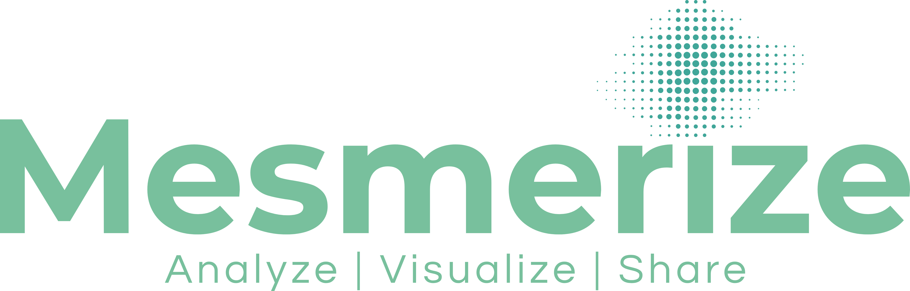

<p align="center">

</p>

<p align="center">
  
<a href="https://pypi.org/project/mesmerize" target="_blank">
    
</a>

<a href="https://pepy.tech/project/mesmerize" target="_blank">
    
</a>

<a href="https://codeclimate.com/github/kushalkolar/MESmerize/maintainability" target="_blank">
    
</a>

<a href="https://www.gnu.org/licenses/gpl-3.0" target="_blank">
    
</a>

<a href="https://gitter.im/mesmerize_discussion" target="_blank">
    
</a>
  
</p>

Mesmerize is a platform for the annotation and analysis of neuronal calcium imaging data. Mesmerize encompasses the entire process of calcium imaging analysis from raw data to interactive visualizations. Mesmerize allows you to create FAIR-functionally linked datasets that are easy to share. The analysis tools are applicable for a broad range of biological experiments and come with GUI interfaces that can be used without requiring a programming background.

---

**Nature Communications:** <a href="https://doi.org/10.1038/s41467-021-26550-y">https://doi.org/10.1038/s41467-021-26550-y</a>

**Documentation:** <a href="http://docs.mesmerizelab.org">http://docs.mesmerizelab.org</a>

**Video Tutorials:** <a href="https://www.youtube.com/watch?v=D9zKhFkcKTk&list=PLgofWiw2s4REPxH8bx8wZo_6ca435OKqg" target="_blank">&rarr; YouTube</a>

**Additional Videos:** <a href="https://www.youtube.com/playlist?list=PLgofWiw2s4RF_RkGRUfflcj5k5KUTG3o_" target="_blank">&rarr; YouTube</a>

---

# Installation

**Mesmerize** is available through **pip**: 

```bash
pip install mesmerize
```

Activate by calling `mesmerize` in the terminal.

**Note**: The *pip* module will only install the core packages. Please see the `Conda Environment` for an easy-to-use installation procedure with all features enabled.

### Module Specific Installations
Please check the [Mesmerize documentation](http://docs.mesmerizelab.org/en/master/user_guides/installation.html) for more details. The following sections will specify which packages are required per module.

#### CaImAn
[CaImAn](https://github.com/flatironinstitute/CaImAn) is used for: `CNMF`, `3D CNMF`, `CNMFE`, `caiman motion correction` and `Detrend DFOF`.

#### tslearn
[tslearn](https://github.com/tslearn-team/tslearn) is used for: `KShape clustering`, `cross-correlation analysis` and some [flowchart nodes](http://docs.mesmerizelab.org/en/master/user_guides/flowchart/nodes.html).

#### TensorFlow and NuSeT
[TensorFlow](https://github.com/tensorflow/tensorflow) and [NuSeT-lib](https://github.com/kushalkolar/nuset-lib) are used for: `nuset segmentation`.

### Conda Environment
The easiest solution for installing mesmerize with **all of its features** is to use the following *conda* `environment.yml`. It is advised to use [mamba](https://github.com/mamba-org/mamba) as it's a faster `C++` implementation of the conda CLI. You can still use the `environment.yml` by creating a mamba environment prior to downloading the packages, using: `mamba create -n mesmerize && mamba env update -n mesmerize --f environment.yml` (directly invoking the use of a file will trigger the underlying conda CLI, the listed commands will ensure we force mamba to do the heavy lifting). You can start this environment with the regular conda CLI: `conda activate mesmerize`.

```yml
name: mesmerize

channels:
  - conda-forge

# From the conda ecosystem.
dependencies:
  - python=3.8
  - pip
  - tensorflow==2.4
  - caiman==1.9.4
  # From the PyPI ecosystem.
  - pip:
    - tslearn==0.4.1
    - git+https://github.com/kushalkolar/MESmerize.git
```

### Virtual Machine
We also provide a **virtual machine** with **[mesmerize and all of its features pre-installed](http://docs.mesmerizelab.org/en/master/user_guides/installation.html#all-platforms)**.

### Docker Image
We do not provide a *Docker Image* due to the graphical nature of mesmerize. If you have a *secure, non-sudo* image by which you run mesmerize: feel free to share it with us at any time!

---

# Questions/Discussions

Feel free to ask questions or discuss a MESmerize topic on our <a href="https://gitter.im/mesmerize_discussion">Gitter</a>. Please use the issue tracker for larger bugs/issues.

**Issue tracker:** https://github.com/kushalkolar/MESmerize/issues

---

# News

See the [changelog](https://github.com/kushalkolar/MESmerize/blob/master/CHANGELOG.md) for more details

**November 2020**

Changes:

- Bokeh based plots that use a bokeh-based datapoint tracer, still in very early stages
- k-Shape "gridsearch", select a n-partitions range and number of combinations, returns heatmap of all k-Shape runs with inertia values NOTE: The gridsearch is not saved when the plot is saved. Only the chosen kshape iteration will be saved. This will be fixed in a future release
- Plot neural dynamics in PCA or LDA space
- PadArrays flowchart node to pad dataframe arrays when sizes don't match, useful when splicing is undesired
- View mean, max, or std projection of caiman motion correction outputs by selecting them from the batch manager

---

# Acknowledgements

- [pyqtgraph](https://github.com/pyqtgraph/pyqtgraph) developers for creating such an expansive library, which we built upon to create many of the interactive elements of Mesmerize. 
- [CaImAn](https://github.com/flatironinstitute/CaImAn) developers have created a very robust library for pre-processing and signal extraction of calcium imaging data, which Mesmerize is able to interface with.
- Simon Daste provided sample data and assistance which allowed for creation of the Suite2p importer module.
- [Jordi Zwiggelaar](https://github.com/Blastorios) created the Mesmerize logo & banner.
