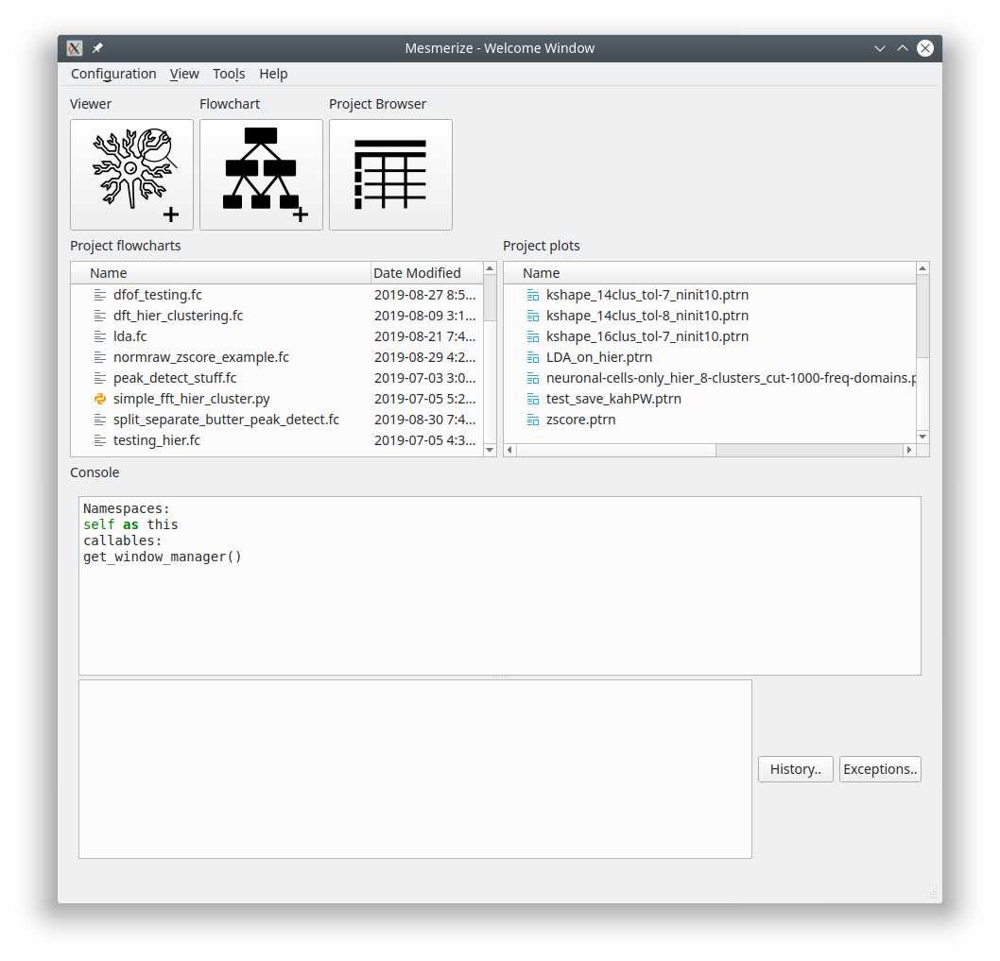
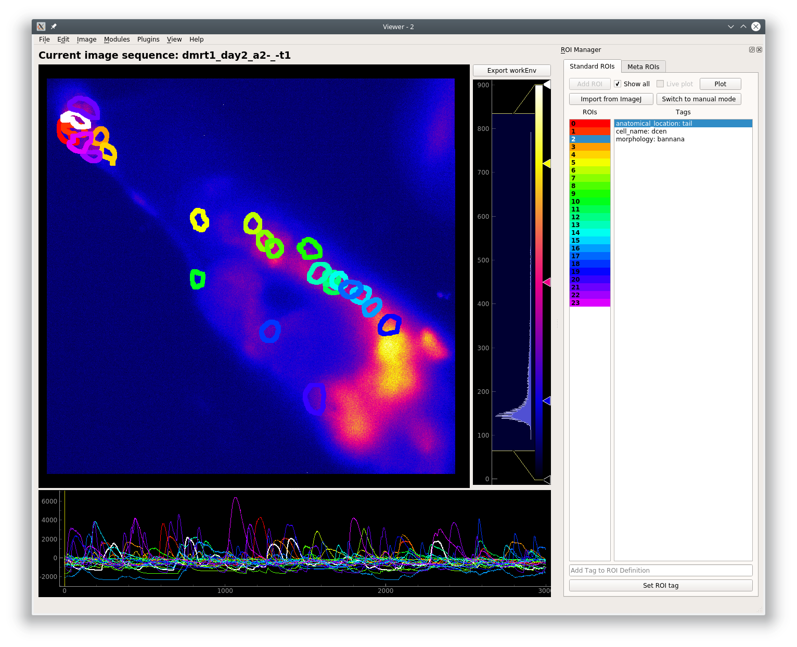
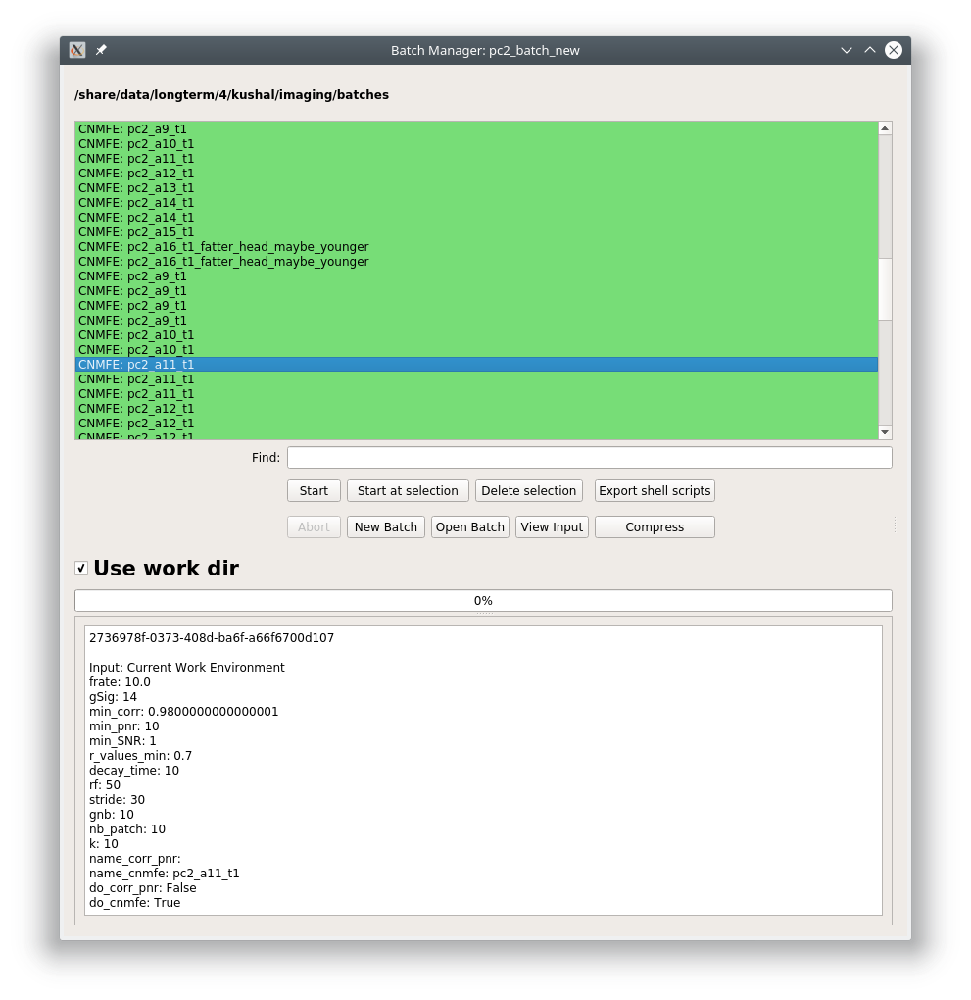

Overview
********

Mesmerize is a platform for the annotation and analysis of neuronal calcium imaging data. It encompasses the entire process of calcium imaging analysis from raw data to semi-final publication figures that are interactive, and aids in the creation of FAIR-functionally linked datasets. It is applicable for a broad range of experiments and is intended to be used by users with and without a programming background.

Welcome Window
^^^^^^^^^^^^^^

Share your analysis pipelines and figures along with your publication

The Viewer
^^^^^^^^^^

Explore image sequences, and use various modules for pre-processing and signal-extraction. Annotate regions of interest with any relevant information. Map stimuli/behavior periods.

CaImAn modules
^^^^^^^^^^^^^^

Mesmerize contains front-end GUI modules for the CaImAn library. This makes it very easy for users without a programming background to use the library.

**CaImAn Elastic Motion Correction**

.. image:: ./imgs/Overview/motion_correction.png

**CNMFE**

.. image:: ./imgs/Overview/cnmfe.png

Batch Manager
^^^^^^^^^^^^^

Computationally intense procedures performed can be organized with the Mesmerize Batch Manager.

Project Organization
^^^^^^^^^^^^^^^^^^^^

Explore project data and create experimental groups.

.. image:: ./imgs/Overview/project_browser.png

Data analysis - pyqtgraph programmable flowcharts.
^^^^^^^^^^^^^^^^^^^^^^^^^^^^^^^^^^^^^^^^^^^^^^^^^^

Build your own analysis piplines using flowcharts.

.. image:: ./imgs/Overview/flowchart.png

Interactive Plots
^^^^^^^^^^^^^^^^^

Create shareable interactive plots where the analysis history of every datapoint is traceable. Explore information associated with a datapoint, such as the spatial localization of its parent ROI and raw data.

**Interactive Heatmaps**

.. image:: ./imgs/Overview/interactive.gif

**Interactive Cross-correlation analysis**

.. image:: ./user_guides/plots/cross_cor.gif

Other types of plots: Beeswarm, Violins, KShape, Proportions, Scatter
