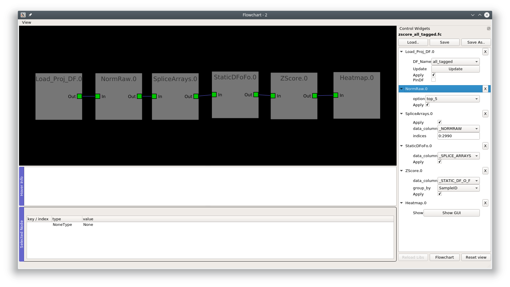
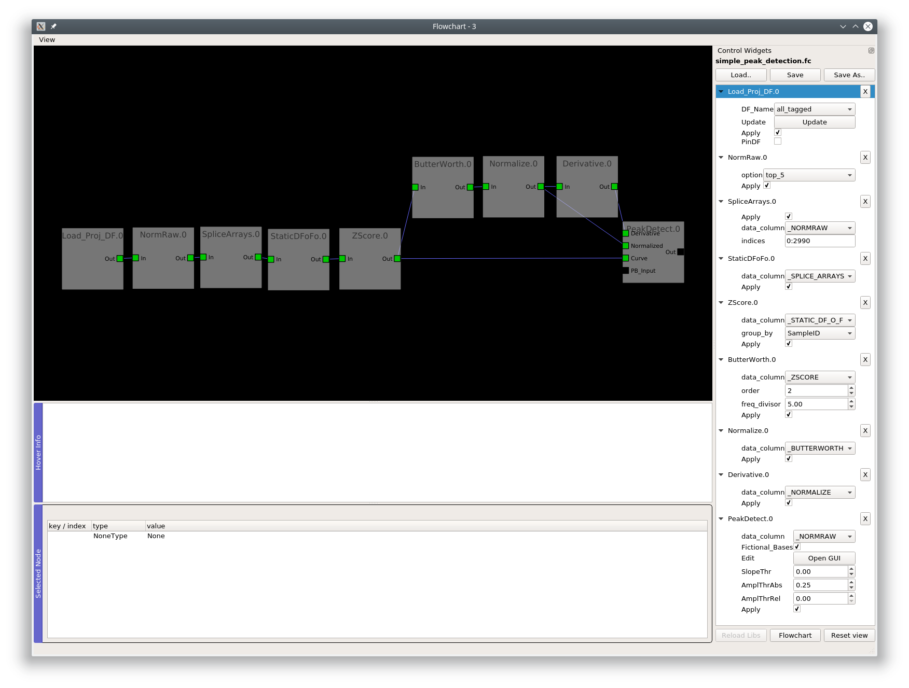

.. _FlowchartExamples:

Examples
********

Datasets
========

You can view examples of flowcharts in the demo dataset or one of the other datasets associated with the paper:

Demo dataset: https://doi.org/10.6084/m9.figshare.11370183

C. intestinalis dataset: https://doi.org/10.6084/m9.figshare.10289162

C. elegans dataset: https://doi.org/10.6084/m9.figshare.10287113

PVC-7 as a Mesmerize dataset: https://doi.org/10.6084/m9.figshare.10293041

Video Tutorials
===============

.. raw:: html

    <iframe width="560" height="315" src="https://www.youtube.com/embed/ghB38QR1yuE" frameborder="0" allow="accelerometer; autoplay; encrypted-media; gyroscope; picture-in-picture" allowfullscreen></iframe>
    
.. raw:: html

    <iframe width="560" height="315" src="https://www.youtube.com/embed/FtMPmXldf9E" frameborder="0" allow="accelerometer; autoplay; encrypted-media; gyroscope; picture-in-picture" allowfullscreen></iframe>
    
.. raw:: html

    <iframe width="560" height="315" src="https://www.youtube.com/embed/mIrps8rJEQ4" frameborder="0" allow="accelerometer; autoplay; encrypted-media; gyroscope; picture-in-picture" allowfullscreen></iframe>
    
.. raw:: html

    <iframe width="560" height="315" src="https://www.youtube.com/embed/5ucFw3OwCC4" frameborder="0" allow="accelerometer; autoplay; encrypted-media; gyroscope; picture-in-picture" allowfullscreen></iframe>
    
.. raw:: html

    <iframe width="560" height="315" src="https://www.youtube.com/embed/Z4dNOK0GGBU" frameborder="0" allow="accelerometer; autoplay; encrypted-media; gyroscope; picture-in-picture" allowfullscreen></iframe>
    
.. raw:: html

    <iframe width="560" height="315" src="https://www.youtube.com/embed/7Hf1BXzkfFc" frameborder="0" allow="accelerometer; autoplay; encrypted-media; gyroscope; picture-in-picture" allowfullscreen></iframe>

Screenshots
===========

Flowchart screenshots from the C. intestinalis dataset.

Z-score
-------

Peak detection
--------------

Hierarchical clustering
------------------------

.. image:: ./hclust_example.png
