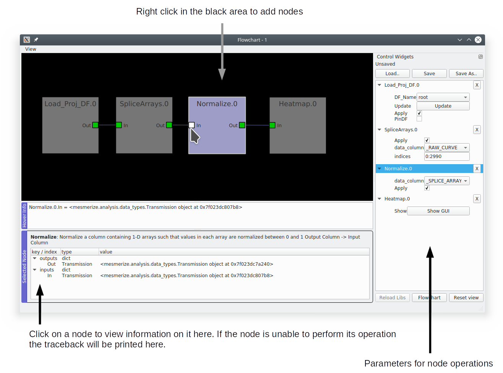

.. _FlowchartOverview:

Flowchart Overview
******************
The flowchart allows you to analyze samples in your project and create plots by arranging analysis nodes. Each node takes an input, performs an operation, and produces an output. For example the :ref:`node_Derivative` node takes use-specified numerical arrays, computes the derivative of these arrays, and then outputs the result.

The Flowchart is based on the `pyqtgraph flowchart widgets <http://www.pyqtgraph.org/documentation/flowchart/>`_

**Flowchart Window**

**Add node**: Right click -> Add node -> Choose from selection

Click on a node to highlight the Control Widget

**Remove node**: Right click -> Remove node

**Connecting nodes**: Click on a node terminal and drag to another terminal

**Save the flowchart layout**: Click "Save as..." to save the layout to a new file. You must specify the file extension as ".fc". If you save this file within the :ref:`"flowcharts" directory <ProjectStructure>` of your project it will show up in the :ref:`WelcomeWindow` when you open your project.

	.. note::
		This does not save the data, use the :ref:`node_Save` node to save data.

	.. warning::
		Due to a weird Qt or pyqtgraph bug certain parameter values (such as those in drop-down menus) can't be saved. Similarly, parameters values are lost when you save to an existing .fc file. If you're interested take a look at ``pyqtgraphCore.WidgetGroup``. Anyways you shouldn't be using the flowchart layout to save this information, that's what the History Trace in Transmission objects is for.

**Load an .fc file**: Click the "Load" button.

**Reset View button**: Reset the view, for example if you zoom out or pan too far.

.. _concept_Transmission:

Transmission
============

:ref:`API Reference <API_Transmission>`

Almost every node uses a Transmission object for input and output. A Transmission is basically a DataFrame and a History Trace (analysis log) of the data within the DataFrame.

	**Transmission DataFrame**

	The Transmission DataFrame is created from your :ref:`Project DataFrame <ProjectBrowser>` (or sub-DataFrame) by the :ref:`Load_Proj_DF node <nodeLoadProjDF>`. This initial DataFrame will contain the same columns as your Project DataFrame, and a new column named **_RAW_CURVE**. Each element (row) in the **_RAW_CURVE** column is a 1-D numerical array representing a single raw curve extracted from an ROI. 

	A new column named **_BLOCK_** is also added which contains the `UUID <https://en.wikipedia.org/wiki/Universally_unique_identifier>`_ for logging the analysis history of this newly created block of DataFrame rows, known as a *data block*. This allows you to merge Transmissions (see :ref:`Merge node <node_Merge>`) and maintain their independent analysis logs prior to the merge.
        
	**Naming conventions for DataFrame columns according to the data types**

	- *numerical data*: single leading underscore ( _ ). All caps if produced by a flowchart node.
	- *categorial data*: no leading underscore. All caps if produced by flowhchart node.
	- *special cases*: Peak detection data are placed in a column named **peaks_bases** where each element is a DataFrame.
	- *uuid data*: has uuid or UUID in the name

	.. note::
		_BLOCK_ is an exception, it contains UUIDs not numerical data.

	**History Trace**

	The History Trace of a Transmission is a log containing the discrete analysis steps, known as operations, along with their parameters and any other useful information. When a flowchart node performs an operation it stores the output(s) data in the Transmission DataFrame and appends the operation parameters to this log. A seperate log is kept for each data block present in the Transmission DataFrame.

.. _console_Flowchart:

Console
=======

You have direct access to the data within the nodes through the console in the flowchart. To show the console go to View -> Console.

.. seealso:: If you are unfamiliar with the console see the overview on :ref:`ConsoleOverview`

Call ``get_nodes()`` to view a dict of all nodes in the flowchart. You can access the output Transmission in most nodes through the attribute `t`. You can access the transmission dataframe through ``t.df``.

.. seealso:: See the :ref:`Transmission API <API_Transmission>` for more information. Sources for the nodes at mesmerize/pyqtgraphCore/flowchart/library.

**Example, directly accessing DataFrame elements through the flowchart console**

.. image:: ./flowchart_console.png

.. _TransmissionFiles:

Transmission Files
==================

You can save a Transmission files using the :ref:`Save node <node_Save>` and work with the data directly in scripts, jupyter notebooks etc. You can also save them through the flowchart console (and plot consoles) through  :func:`Transmission.to_hdf5 <mesmerize.Transmission.to_hdf5>`.

Load Transmission
-----------------

Load a saved Transmission instance using :func:`Transmission.from_hdf5 <mesmerize.Transmission.from_hdf5>`

.. code-block:: python
    :linenos:
    
    >>> from mesmerize import Transmission
    >>> from uuid import UUID
    
    >>> t = Transmission.from_hdf5('/share/data/temp/kushal/data.trn')
    <mesmerize.analysis.data_types.Transmission at 0x7f4d42f386a0>
    
    # The DataFrame is always the 'df' attribute
    >>> t.df.head()
    
                                               CurvePath  ... FCLUSTER_LABELS
    0  curves/a2-_-1-_-843c2d43-75f3-421a-9fef-483d1e...  ...               8
    1  curves/brn3b_a6-_-2-_-21557a64-6868-4ff4-8db1-...  ...               4
    2  curves/brn3b_a6-_-2-_-21557a64-6868-4ff4-8db1-...  ...               5
    3  curves/brn3b_day1_3-_-2-_-ff3e95df-0e15-495c-9...  ...               8
    4  curves/brn3b_day1_3-_-2-_-ff3e95df-0e15-495c-9...  ...               6

    [5 rows x 27 columns]

View History Log
----------------

Transmissions have a `history_trace` attribute which is an instance of :class:`HistoryTrace <mesmerize.analysis.data_types.HistoryTrace>`.

Use the :func:`get_data_block_history <mesmerize.analysis.data_types.HistoryTrace.get_data_block_history>` and :func:`get_operations_list <mesmerize.analysis.data_types.HistoryTrace.get_operations_list>` methods to view the history log of a data block.

.. code-block:: python
    :linenos:
    
    # To view the history log, first get the block UUID of the dataframe row of which you want the history log
    
    # Block UUIDs are stored in the _BLOCK_ column
    >>> bid = t.df.iloc[10]._BLOCK_
    >>> bid
    
    '248a6ece-e60e-4a09-845e-188a5199d262'
    
    # Get the history log of this data block
    # HistoryTrace.get_operations_list() returns a list of operations, without parameters
    # HistoryTrace.get_data_block_history() returns the operations list with the parameters
    >>> t.history_trace.get_operations_list(bid)
    
    ['spawn_transmission',
     'splice_arrays',
     'normalize',
     'rfft',
     'absolute_value',
     'log_transform',
     'splice_arrays',
     'fcluster']
    
    # View the entire history log with all params
    >>> t.history_trace.get_data_block_history(bid)
    
    [{'spawn_transmission': {'sub_dataframe_name': 'neuronal',
    'dataframe_filter_history': {'dataframe_filter_history': ['df[~df["promoter"].isin([\'cesa\', \'hnk1\'])]',
        'df[~df["promoter"].isin([\'cesa\', \'hnk1\'])]',
        'df[~df["cell_name"].isin([\'not_a_neuron\', \'non_neuronal\', \'untagged\', \'ependymal\'])]']}}},
    {'splice_arrays': {'data_column': '_RAW_CURVE',
    'start_ix': 0,
    'end_ix': 2990,
    'units': 'time'}},
    {'normalize': {'data_column': '_SPLICE_ARRAYS', 'units': 'time'}},
    {'rfft': {'data_column': '_NORMALIZE',
    'frequencies': [0.0,
        0.0033444816053511705,
        0.0033444816053511705,
        0.006688963210702341, 
        ...
    
    # Get the parameters for the 'fcluster' operation
    >>> fp = t.history_trace.get_operation_params(bid, 'fcluster')
    
    # remove the linkage matrix first so we can view the other params
    >>> fp.pop('linkage_matrix');fp
    
    {'threshold': 8.0,
     'criterion': 'maxclust',
     'depth': 1,
     'linkage_params': {'method': 'complete',
     'metric': 'wasserstein',
     'optimal_ordering': True}}

    
    
    
    
        
    
