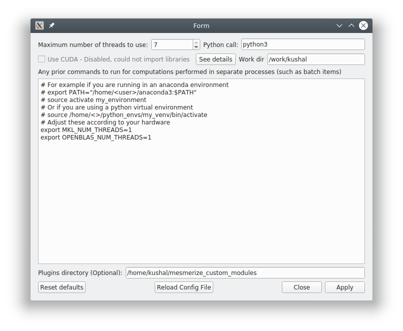

.. _WelcomeWindow:

Welcome Window
==============

The Welcome Window is the first window that you are presented with when you launch Mesmerize.

- Use the large buttons for opening new :ref:`Viewer <ViewerOverview>` or :ref:`Flowchart <FlowchartOverview>` windows.

- Open a project using the button, or double-click a recent project from the list.

- Create a new project using the button.

- You basically have access to all objects in the Mesmerize instance through this console.

.. seealso:: :ref:`User guide on creating new projects <CreateNewProject>` and :ref:`Consoles <ConsoleOverview>`

.. image:: ./welcome_window.png

.. _ProjectStructure:

Project Structure
=================

A Mesmerize project is encapsulated within a single directory. It contains the following:

- config file - contains configuration data, such as roi type columns, stimulus type columns, and custom columns with their datatypes.

.. warning:: Do not manually modify the config file

**Directories**

=============   ===================================================================================
Dir             Purpose
=============   ===================================================================================
dataframes      Contains an file storing the project dataframe, root.dfr, and backups.

                A new backup is created every time a :ref:`Sample <ProjectSample>` is added to the project.
                
                Restore a backup by renaming it to "root.dfr".

images          Contains the image sequences and work environment data for all samples in the project

curves          Contains the curves for every sample in the project

batches         Used for storing batches used by the :ref:`Batch Manager <BatchManager>` if you wish.

flowcharts      Used for storing *.fc* flowchart files that save the layout of nodes in a flowchart.

plots           Used for storing *.ptrn* interactive plot files.
=============   ===================================================================================

.. seealso:: :ref:`Flowchart Overview <FlowchartOverview>` and :ref:`Saving Plots <save_ptrn>`

.. warning:: Do not manually modify the data under the **images** or **curves** directories

.. _ProjectSample:

Project Sample
==============

.. _ConsoleOverview:

Consoles
========

A Python console is embedded in many parts of Mesmerize. You can use it to perform very specific operations, further automate tasks, save an analysis object, format plots, etc.

The console is accessible in many windows through View -> Console. Within the console namespace ``this`` refers to the window. For example ``this`` refers to the :ref:`Project Browser <ProjectBrowser>` Window instance in the Project Browser's console. A list of useful object references and helper functions are listed when you open most consoles.

You can run entire scripts within the console. You can also use import statements to import libraries that you have in your Python environment.

Keyboard controls:

**Execute:** Shift + Enter

**New line:** Enter

**Scroll up through history**: Page Up

**Scroll down through history:** Page Down

The history is stored in ``~/.mesmerize``

.. _save_ptrn:

Saving plots
============

Some plots allow you to save them in an interactive form, along with the plot data and the plot state as a ".ptrn" file. If you save the file in the "plots" directory of your project it will be listed in the :ref:`WelcomeWindow` when you open your project.

This is currently possible with the following plots: :ref:`plot_Heatmap`, :ref:`plot_KShape`, :ref:`plot_Proportions`, :ref:`plot_ScatterPlot`, and :ref:`plot_SpaceMap`

.. _plot_Navbar:

Plot Navbar
===========

Many plots have a navigation toolbar which you can use to zoom, pan, configure plots, and export plots as images.

Official matplotlib docs about the navigation toolbar: https://matplotlib.org/2.1.2/users/navigation_toolbar.html

**Home:** Reset the plot (not applicable for all plots)

**Pan:** Pan the plot

**Zoom:** Zoom in/out a selection using the left/right mouse button respectively

**Subplot-configuration:** Options to adjust spacing, borders, set tight layout.

**Edit axis, curve...:** For some plots. Options for formating x & y axis limits, labels, select line style, color, etc.

**Save:** Export the figure as an image.  **This is not the same as saving an interactive plot, see "Saving Plots" above**.

.. _SystemConfiguration:

System Configuration
====================

**Set system configuration options**

This window is accessible through the :ref:`Welcome Window <WelcomeWindow>` menubar at Configuration -> System Configuration.

**Maximum number of threads to use:** The maximum number of threads that Mesmerize is allowed to use, this includes proccesses started by the :ref:`Batch Manager <BatchManager>`, various analysis proccesses in the flowchart, and the viewer as well.

**Python call:** Many parts of Mesmerize, such as the :ref:`Batch Manager <BatchManager>` use external processes to run a python script. This setting sets which python call should be used. The default setting of "python3" should work for both :ref:`snap <snap_install>` and :ref:`pip <pip_install>` installations unless you have written a custom expansion that uses python2.

**Use CUDA:** Use CUDA accerlation if you have a GPU with CUDA cores. Only works with the :ref:`pip installation <pip_install>`, and you must have pycuda and scikit-cuda (as well as the `nvidia CUDA toolkit <https://developer.nvidia.com/cuda-toolkit>`_) installed. In Mesmerize CUDA is currently used only by :ref:`Caiman Motion Correction <module_caiman_motion_correction>`. We plan to expand CUDA support to computationally intensive tasks that are performed by flowchart nodes.

**Work dir:** Many parts of Mesmerize use a working directory for temporary files. If you have a fast filesystem you can use that for this purpose.

**Pre-run commands (large text entry):** Mesmerize runs some computationally intensive tasks in subprocesses. These commands are run prior to the python script that performs the task.

    - If you are using Mesmerize in a virtual environment (such as a :ref:`pip installed <pip_install>` Mesmerize) you will need activate the environment so you must include the line ``source /path_to_venv/bin/activate`` to the pre-run commands
    
    - Simiarly if you are using Mesmerize in an Anaconda environment you will need include commands to activate the environment.
    
    - If you are using an Intel CPU you should get optimal performance by installing `Math Kernel Library (MKL) <https://software.intel.com/en-us/get-started-with-mkl-for-linux>`_ and including ``export MKL_NUM_THREADS=1`` to the pre-run commands.
    
    - If you are using an AMD CPU make sure you have OpenBLAS installed for optimal performance and include ``export OPENBLAS_NUM_THREADS=1`` to the pre-run commands. You may better performance by installing the `AMD specific libraries <https://developer.amd.com/amd-aocl/blas-library/>`_.

**Plugins directory:** If you have a plugins dir include enter its path here.
