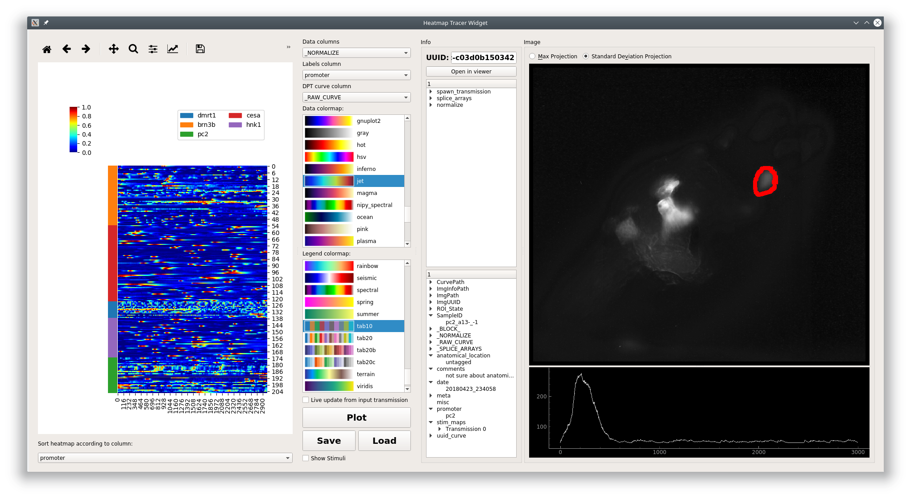

.. _plot_Heatmap:

Heatmap
*******

:ref:`API Reference <API_HeatmapTracerWidget>`

.. note::
	This plot can be saved in an interactive form, see :ref:`Saving plots <save_ptrn>`

Visualize numerical arrays in the form of a heatmap. Also used for visualization of Hierarchical clusterting dendrograms. :ref:`DatapointTracer` is embedded.

Video Tutorial
==============

This tutorial shows how the Heatmap plot can be used along with the Datapoint Tracer during the latter half of this tutorial.

.. raw:: html

    <iframe width="560" height="315" src="https://www.youtube.com/embed/ghB38QR1yuE" frameborder="0" allow="accelerometer; autoplay; encrypted-media; gyroscope; picture-in-picture" allowfullscreen></iframe>

Layout
======

**Left:** The heatmap. Clicking the heatmap highlights the selected row and upates the :ref:`DatapointTracer`. Right click on the heatmap to clear the selection highlight on the heatmap. You can zoom and pan the heatmap using the tools above the plot area. You can zoom/pan in the legend and heatmap. The up and down keys on your keyboard can be used to move the current row selection.

**Bottom left:** Set the row order of the heatmap according to a categorical column.

**Middle:** Plot controls.

**Very bottom:** Status label - displays any issues that were raised while setting the plot data. Click on the status label to see more information.

Parameters
==========

**Data column:** Data column, numerical arrays, that contain the data for the heatmap. Each row of this data column (a 1D array) is represented as a row on the heatmap.

**Labels column:** Column containing categorical labels that are used to create the row legend for the heatmap.

**DPT curve column:** Data column, containing numerical arrays, that is shown in the :ref:`DatapointTracer`.

**Data colormap:** Colormap used for representing the data in the heatmap. Default is 'jet'.

**Legend colormap:** Colormap used for the row legend.

**Live update from input transmission:** If checked this plots receives live updates from the :ref:`flowchart <FlowchartOverview>`.

**Plot:** Updates data input from the flowchart.

**Save:** :ref:`Save the plot data and state in an interactive form <save_ptrn>`

**Load:** Load a plot that has been saved as a ".ptrn" file.

**Layout to visualize Hierarchical Clustering**

.. image:: ./heatmap_clustering.png

This plot widget can also be used to visualize a dendrogram on top of a heatmap of data.

The differences are:

#. There are two legend bars

	- Left: Cluster label
	- Right: Corresponds to Labels column parameter.

#. You can also zoom/pan the dendrogram in addition to the legends and heatmap.

#. Sorting the heatmap rows is disabled because this wouldn't make sense

Console
=======

You can directly access the heatmap widget through the console. This is useful for plot customization and exporting with specific parameters.

Toggle the console's visibility by clicking on the "Show/Hide Console" button at the bottom of the controls.

.. seealso:: :ref:`API Reference <API_HeatmapTracerWidget>`

Namespace
---------

=====================       ========================================================================================
reference                   Description
=====================       ========================================================================================
this                        The higher-level :ref:`HeatmapTracerWidget <API_HeatmapTracerWidget>` instance, i.e. the entire widget
this.transmission           Current input :ref:`Transmission <concept_Transmission>`
get_plot_area()             Returns the lower-level :ref:`Heatmap <API_Variant_Heatmap>` variant instance, basically the actual plot area
get_plot_area().plot        Returns the seaborn ClusterGrid instance containing the axes
get_plot_area().fig         Returns the matplotlib `Figure <https://matplotlib.org/2.1.2/api/_as_gen/matplotlib.figure.Figure.html#matplotlib-figure-figure>`_ instance
=====================       ========================================================================================

**Attributes of** ``get_plot_area().plot``

For example, the heatmap axes object can be retrieved through ``get_plot_area().plot.ax_heatmap``. See the usage examples.

==================      =======================================
ax_heatmap              Heatmap axes
ax_row_dendrogram       Row dendrogram axes
ax_col_dendrogram       Used for the legend
cax                     Colorbar axes
==================      =======================================

Examples
--------

Export
^^^^^^

.. seealso:: matplotlib API for: `Figure.savefig <https://matplotlib.org/2.1.2/api/_as_gen/matplotlib.figure.Figure.html#matplotlib.figure.Figure.savefig>`_, `Figure.set_size_inches <https://matplotlib.org/2.1.2/api/_as_gen/matplotlib.figure.Figure.html#matplotlib.figure.Figure.set_size_inches>`_, `Figure.get_size_inches <https://matplotlib.org/2.1.2/api/_as_gen/matplotlib.figure.Figure.html#matplotlib.figure.Figure.get_size_inches>`_

.. code-block:: python
    
    # Desired size (width, height)
    size = (2.0, 2.5)
    
    # Get the figure
    fig = get_plot_area().fig
    
    # original size to reset the figure after we save it
    orig_size = fig.get_size_inches()
    
    #Set the desired size
    fig.set_size_inches(size)
    
    # Save the figure as a png file with 1200 dpi
    fig.savefig('/share/data/temp/kushal/amazing_heatmap.png', dpi=1200, bbox_inches='tight', pad_inches=0)
    
    # Reset the figure size and draw()
    fig.set_size_inches(orig_size)
    get_plot_area().draw()
    
.. note:: The entire plot area might go gray after the figure is reset to the original size. I think this is a Qt-matplotlib issue. Just resize the window a bit and the plot will be visible again!

.. warning:: From my experience I have not been able to open clustermap SVG files saved with very high DPI (600+). Even with 32 cores & 128GB of RAM both inkscape and illustrator just hang ¯\\_(ツ)_/¯. Try png or other formats.

x tick labels
^^^^^^^^^^^^^

.. seealso::  `matplotlib.axes.Axes.set_xticklabels <https://matplotlib.org/2.1.2/api/_as_gen/matplotlib.axes.Axes.set_xticklabels.html#matplotlib.axes.Axes.set_xticklabels>`_, `matplotlib.axes.Axes.set_xticks <https://matplotlib.org/2.1.2/api/_as_gen/matplotlib.axes.Axes.set_xticks.html#matplotlib.axes.Axes.set_xticks>`_.

If the data are in the time domain:

.. code-block:: python
    
    from mesmerize.analysis import get_sampling_rate
    import numpy as np
    
    # Get the sampling rate of the data
    sampling_rate = get_sampling_rate(this.transmission)
    
    # Number of frames currently displayed in the heatmap
    num_frames = get_plot_area().data.shape[1]
    
    # Set an appropriate interval
    interval = 30 # This is in seconds, not frames
    
    # Get the recording time in seconds
    recording_time = int(num_frames / sampling_rate)
    
    # Set the new ticks
    get_plot_area().plot.ax_heatmap.set_xticks(np.arange(0, num_frames, interval * sampling_rate))
    
    # Set the tick labels
    # You can change the fontsize here
    get_plot_area().plot.ax_heatmap.set_xticklabels(np.arange(0, recording_time, interval), fontdict={'fontsize': 4})
    
    # Set a title for the x axis. You can change the fontsize here
    get_plot_area().plot.ax_heatmap.set_xlabel('Time (seconds)', fontdict={'fontsize': 6})
    
    # Draw the plot with these changes
    get_plot_area().draw()
    
.. note:: You may need to resize the dock widget that the plot is present in to display the newly drawn plot, this is a Qt-matplotlib issue.

If the data are in the frequency domain:

.. code-block:: python
    
    from mesmerize.analysis import get_frequency_linspace
    import numpy as np
    
    # Get frequency linspace and Nyquist frequency
    freqs, nf = get_frequency_linspace(this.transmission)
    
    # Get the number of frequencies currently shown in the heatmap
    num_freqs = get_plot_area().data.shape[1]
    
    # The max frequency currently display in the heatmap
    max_freq = freqs[num_freqs - 1]
    
    # Set an appropriate interval
    interval = 0.25 # This is in Hertz
    
    # Set the tick labels
    # Set the new ticks
    get_plot_area().plot.ax_heatmap.set_xticks(np.arange(0, num_freqs, (num_freqs * interval) / max_freq))
    
    # You can change the fontsize here
    get_plot_area().plot.ax_heatmap.set_xticklabels(np.arange(0, max_freq, interval), fontdict={'fontsize': 4})
    
    # Set a title for the x axis. You can change the fontsize here
    get_plot_area().plot.ax_heatmap.set_xlabel('Frequency (Hertz)', fontdict={'fontsize': 6})
    
    # Draw the plot with these changes
    get_plot_area().draw()

.. note:: You may need to resize the dock widget that the plot is present in to display the newly drawn plot, this is a Qt-matplotlib issue.

Colorbar label
^^^^^^^^^^^^^^

.. code-block:: python

    get_plot_area().plot.cax.set_title('norm. z-score', x=-0.25, y=0.65, fontdict={'fontsize': 6}, rotation=90)
    get_plot_area().draw()
    
Axes visibility
^^^^^^^^^^^^^^^

Hide/show legend

.. code-block:: python

    get_plot_area().plot.ax_col_dendrogram.set_visible(False)
    get_plot_area().draw()

Hide/show y axis (similar for x axis)

.. code-block:: python

    get_plot_area().plot.ax_heatmap.get_yaxis().set_visible(False)
    get_plot_area().draw()
    
Hide/show colorbar

.. code-block:: python

    get_plot_area().plot.cax.set_visible(False)
    get_plot_area().draw()
