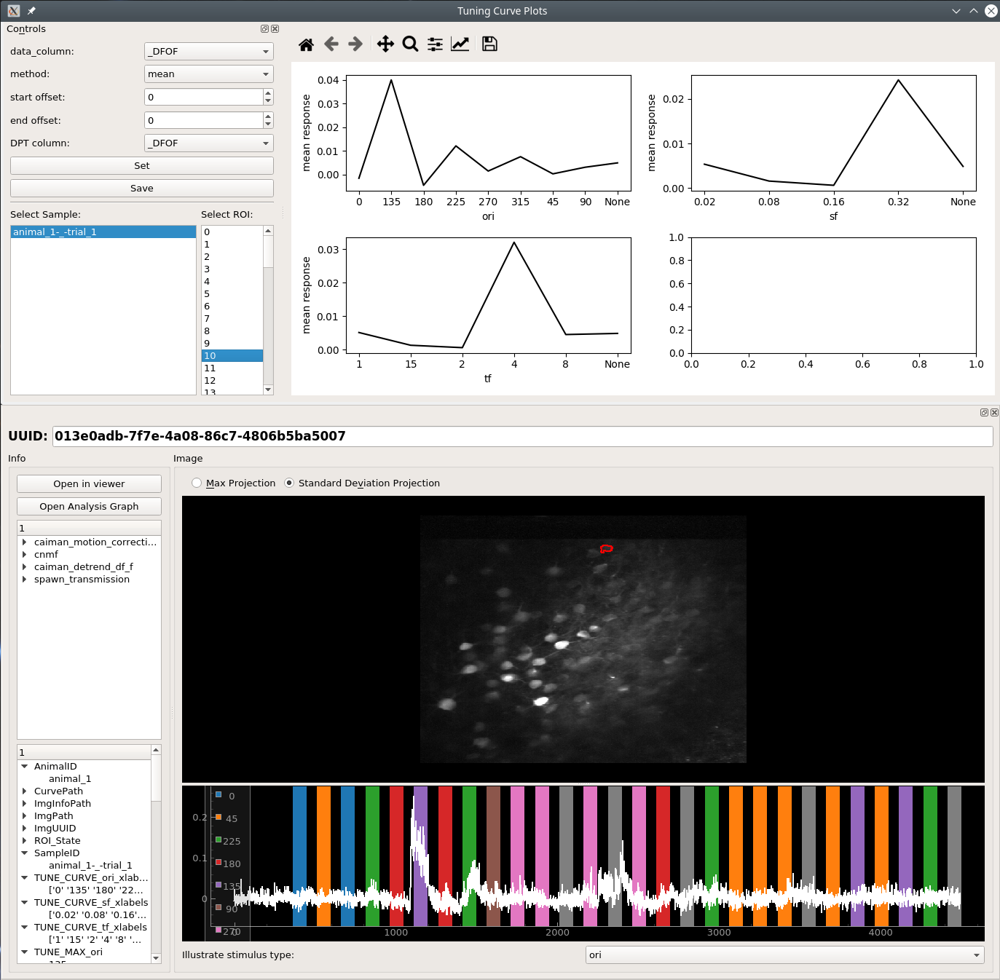

.. _plot_StimulusTuning:

Stimulus Tuning
***************

Get the stimulus tuning and tuning curves of neurons.

The output from this plot node can also be used for various things downstream, such as hierarchical clustering to sort your cells based on their tuning, visualizing the tuning of each neuron using a :ref:`SpaceMap plot <plot_SpaceMap>`, and much more. See the video tutorial for examples.

Video Tutorial
==============

This tutorial uses part of the `CRCNS pvc-7 dataset from the Allen Institute <http://crcns.org/data-sets/vc/pvc-7/about-pvc-7>`_ to get stimulus tuning curves, perform hierarchical clustering and dimensionality reduction.

.. raw:: html

    <iframe width="560" height="315" src="https://www.youtube.com/embed/FtMPmXldf9E" frameborder="0" allow="accelerometer; autoplay; encrypted-media; gyroscope; picture-in-picture" allowfullscreen></iframe>

Layout
======

============    ============================================================================
Parameter       Description
============    ============================================================================
data_column     Data column used to determine the stimulus tuning of the cells
method          Use one of ``mean``, ``median``, ``max`` or ``min`` response within a stimulus period to determine the tuning
start offset    Use a start offset for the stimulus periods (can be either positive or negative)
end offset      Use a end offset for the stimulus periods (can be either positive or negative)
DPT column      Data column that is shown in the :ref:`DatapointTracer`.
Set             Set the stimulus extraction parameters defined above.
Save            :ref:`Save the plot data and state in an interactive form <save_ptrn>`
============    ============================================================================

Usage
=====

#. Set the desired parameters for **data_column**, **method**, **start offset**, **end offset** and **DPT column**.

#. Click **Set**.

#. Choose a Sample from the list.

#. Click on an ROI number to view the tuning curve, and corresponding spatial localization and curve in the :ref:`DatapointTracer`.

#. You can use the output of this plot node for further analysis, as show in the tutorial video.
