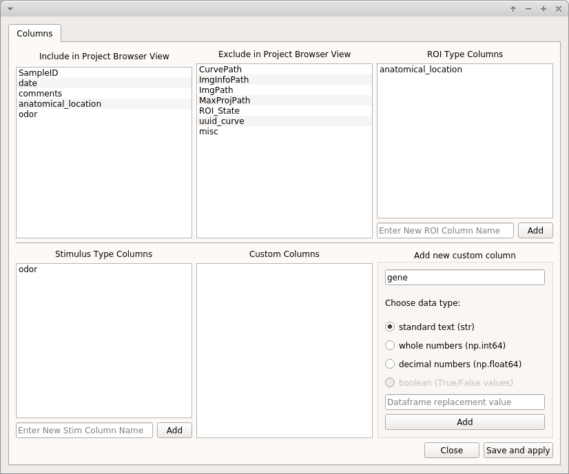

.. _CreateNewProject:

Create a New Project
********************

Video Tutorial
==============

This tutorial shows how to create a New Project, open images in the Viewer, use the Stimulus Mapping module and perform Caiman motion correction

.. raw:: html

    <iframe width="560" height="315" src="https://www.youtube.com/embed/D9zKhFkcKTk" frameborder="0" allow="accelerometer; autoplay; encrypted-media; gyroscope; picture-in-picture" allowfullscreen></iframe>

Biological Questions
====================
**Before you create a new Mesmerize Project you must think about the biological questions that you are interested in. Here are some thoughts to help you:**

	- The effects of different types of temporary stimulation or behavior? Such as odors, visual stimuli etc.

	- Are you interested in neuronal activity during specific behavioral periods?

	- Differences in calcium dynamics between different anatomical regions or cell types?

	- Experiments using transgenes to stimulate or suppress specific cells, such as with optogenetics or chemogenetics.

	- Long-duration/chronic exposure to pharmacological agents. For example, if you are inducing seizures with drugs like PTZ

	- Differences in calcium dynamics between different stages during development.

	- Differences in calcium dynamics between different cell types using GCaMP driven by specific promoters.

All of the above information can be encoded by different types of *categorical variables* within the Mesmerize *Project Configuration*.

----

New Project
===========

To create a new project click **New Project** in the :ref:`Welcome Window <WelcomeWindow>`. You will then be prompted to choose a location and a name for the project. This will create a directory with the chosen name in the location you previously selected.

.. _project-configuration:

Project Configuration
=====================

After setting a project name you must configure it. This is where your biological questions of interest are important. You can change your project configuration later, but it is most time efficient if you enter all your categories of interest now.

.. image:: ./4.png

.. warning:: Restart Mesmerize whenever you change the project configuration.

.. note:: If you have Samples in your project and you change the project configuration at a later date to add new columns, all existing rows in your project DataFrame are labelled as "untagged" for the new columns.

.. seealso:: :ref:`Add To Project Guide <add-to-project>` **to understand how the project configuration relates to the addition of data samples to your project**

Categorical Data Columns
------------------------
**Mesmerize allows you to create three main different types of categorical data columns (for the project DataFrame), and an unlimited number of each type. These categorical data columns allow you to group your data during analysis, and therefore perform comparisons between experimental groups. In essense, these categorical data columns form scaffold with which you can create your experimental groups during analysis.**

.. note:: You can change the project configuration at any point in the future by adding new columns or changing the visible/hidden columns.

.. note:: It is generally advisable to keep the names of your categorical data columns short with lowercase letters. When sharing your project you can provide a mapping for all your keys. This helps maintain consistency throughout your project and makes the data more readable.

.. _ROITypeColumns:

ROI Type Columns
^^^^^^^^^^^^^^^^

Create ROI-bound *categories* with which you want to group your data. Enter the desired name for the category and click **Add**. Here are some examples:

	- If you are interested in calcium dynamics between different anatomical regions, you create a column named ``anatomical_region``.
	- You want to define defined notochord cell identities on a anterior-posterior axis, defined as "cell_1", "cell_2", \.\.\. "cell_n". You can create an ROI Type Column named ``notochord_cell_id``.

.. seealso:: :ref:`ROI Manager <ROIManager>` to understand how labels can be tagged onto ROIs using these categories that you have defined in the ROI Type Columns.

.. _StimulusTypeColumns:

Stimulus Type Columns
^^^^^^^^^^^^^^^^^^^^^

If you're interested in mapping temporal information to your traces, such as stimuli or behavioral periods, add a “Stimulus Type column” for each type. This is only for temporary stimulation or behavioral periods that do not span the entire length of the video.

.. seealso:: :ref:`Stimulus Mapping guide <StimulusMapping>` to understand how stimuli can be labelled.**

.. _CustomColumns:

Custom Columns
^^^^^^^^^^^^^^

Here you can create categories to tag any other piece of useful information to each Sample. i.e. to the entire video recording. For example:

	- You are studying seizures, you perform a 5 minute recording in the medium, and then subsequent 5 minute recordings in PTZ. You can create a category called "drug_state". When you add samples to your project you can tag drug states named "control",  "ptz_1", "ptz_2", "ptz_recovery_1" etc.
	- This is also what you would use for chemogenetics experiments if you are recording for example without CNO for 5 minutes, and then with CNO for another 5 minutes.

Three different data types can be tagged to a category, **standard text**, **whole numbers**, and **decimal numbers**.

.. warning:: Data types cannot be changed later. If you are familiar with pandas you can manually change it, and the corresponding value in the project config file.

If you want to tag numerical information, such as the animal’s development stage, it can be useful to set the data type to **whole numbers**. This allows you to sort your data numerically. For example you may want to compare dynamics of all curves between stage 48 and 72.

.. image:: ./6.png

If you are interested in dynamics between different cell types for which you are using specific GCaMP promoters, you can create a custom column called ``promoter`` or ``cell_type`` and select **standard text** as the data type.

When you add samples to your project from the viewer, you will be prompted to enter information that is directly based on the Custom Columns that you create here.

.. seealso:: :ref:`Add to Project guide <add-to-project>`

.. image:: ./add_to_proj.png

----

Visible / Hidden in Project Browser
-----------------------------------

You can drag and drop items (column names) between these two lists to set which ones are visible in the Project Browser. This is just to avoid clutter.

.. seealso:: :ref:`Project Browser <ProjectBrowser>`
