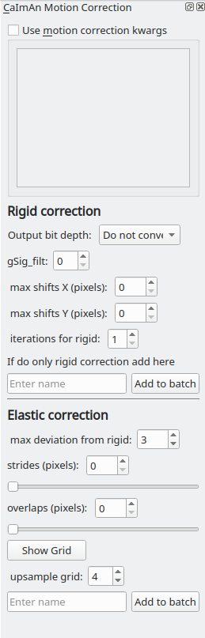

.. _module_CaimanMotionCorrection:

Caiman Motion Correction
************************

Perform motion correction using the NoRMCorre implementation in the CaImAn library.

**I highly recommend going through the following before using this module**

    - NoRMCorre paper
        `Pnevmatikakis, E. A., & Giovannucci, A. (2017). NoRMCorre: An online algorithm for piecewise rigid motion correction of calcium imaging data. Journal of Neuroscience Methods, 291, 83–94. <https://doi.org/10.1016/j.jneumeth.2017.07.031>`_

    - The CaImAn demo notebook, the implementation in Mesmerize is basically from the demo
        https://github.com/flatironinstitute/CaImAn/blob/master/demos/notebooks/demo_motion_correction.ipynb

**Parameters**

Output bit depth: The motion corrected image sequences are of float32 type. You can optionally convert the output to 8 or 16 bit uint types to save disk space. **This doesn't always work from my experience, values might get clipped**.

For all other parameters please see the demo notebook mentioned above.

You can also enter parameters as keyword arguments (kwargs) in the text box if you select "Use motion correction kwargs". This is useful if you want to enter parameters that cannot be entered in the GUI for example. **Use single quotes if you want to enter string kwargs, do not use double quotes.**

Usage
=====

This module adds a "caiman motion correction" *item* to the batch. Set the desired parameters (see demo notebook) and then enter a name to add it as an *item* to the batch. After the batch item is processed, double-click the batch item to open the motion corrected image sequence in the viewer. You can then use this motion corrected image sequence for further analysis.

.. seealso:: This modules uses the :ref:`Batch Manager <module_BatchManager>`.

.. note:: The parameters used for motion correction are stored in the work environment of the viewer and this log is carried over and saved in the *Project Sample* as well. To see the parameters that were used for motion correction in the viewer, execute ``get_workEnv().history_trace`` in the viewer console and look for the ``caiman_motion_correction`` entry.

.. _MotCorScripts:

Script Usage
============

A script can be used to add caiman motion correction batch items. This is much faster than using the GUI.

.. seealso:: :ref:`Script Editor <module_ScriptEditor>`

Add items
---------

This example shows how to add all tiff files (of image sequences) from a directory as batch items with 3 different variants of parameters.

.. seealso:: This example uses the :ref:`Caiman Motion Correction Module API <API_CaimanMotionCorrection>`, :ref:`ViewerWorkEnv API <API_ViewerWorkEnv>`, and :ref:`Batch Manager API <API_BatchManager>`

.. code-block:: python
    :linenos:
    
    # Import glob so we can get all tiff files in a dir
    from glob import glob
    # Import os to get filenames from paths
    import os

    # Motion correction params.
    
    mc_kwargs = \
    {
        "max_shifts":           (6, 6),
        "niter_rig":            2,
        "max_dev":              3,
        "strides":              196,
        "overlaps":             98,
        "upsample_factor_grid": 4,
        "gSig_filt":             (10, 10)  # Set to `None` for 2p data
    }
    
    params = \
    {
        'mc_kwargs':        mc_kwargs,  # the kwargs we set above
        'item_name':        "will set later per file",
        'output_bit_depth': "Do not convert"  # can also set to `8` or `16` if you want the output in `8` or `16` bit
    }

    # Path to the dir containing images
    files = glob("/full_path_to_raw_images/*.tiff")
    # Sort in alphabetical order (should also work for numbers)
    files.sort()

    # Open each file, crop, and add to batch with 3 diff mot cor params
    for i, path in enumerate(files):
        print("Working on file " + str(i + 1) + " / " + str(len(files)))
        
        # get json file path for the meta data
        meta_path = path[:-5] + ".json"
        
        # Create a new work environment with this image sequence
        work_env = ViewerWorkEnv.from_tiff(path, "asarray-multi", meta_path)
        
        # set it as the current work environment
        vi.viewer.workEnv = work_env
        vi.update_workEnv()
        
        # Get caiman motion correction module, hide=False to not show GUI
        mc_module = get_module("caiman_motion_correction", hide=True)
        
        # Set name for this video file
        name = os.path.basename(path)[:-5]
        params["item_name"] = name
        
        # First variant of params
        params["mc_kwargs"]["strides"] = 196
        params["mc_kwargs"]["overlaps"] = 98
        
        # Add one variant of params for this video to the batch
        mc_module.add_to_batch(params)
        
        # Try another variant of params
        params["mc_kwargs"]["strides"] = 256
        params["mc_kwargs"]["overlaps"] = 128
        
        # Set these params and add to batch
        mc_module.add_to_batch(params)
        
        # Try one more variant of params	
        params["mc_kwargs"]["strides"] = 296
        params["mc_kwargs"]["overlaps"] = 148
        
        # Set these params and add to batch
        mc_module.add_to_batch(params)
        
    # If you want to process the batch after adding the items uncomment the following lines
    #bm = get_batch_manager()
    #bm.process_batch(clear_viewers=True)
    

Crop and add items
------------------

This example shows how to crop videos prior to adding them as batch items. This is useful if you want to crop-out large unchanging regions of your movides. It uses either simple thresholding or spectral salieny on a standard deviation projection to determine the bounding box for cropping.

.. seealso:: This example uses the :ref:`Caiman Motion Correction Module API <API_CaimanMotionCorrection>`, :ref:`ViewerWorkEnv API <API_ViewerWorkEnv>`, and :ref:`Batch Manager API <API_BatchManager>`

.. code-block:: python
    :linenos:

    # Import glob so we can get all tiff files in a dir
    from glob import glob
    # Import os to get filenames from paths
    import os
    
    # Just get a shortcut reference to the auto_crop function
    auto_crop = image_utils.auto_crop
    
    # Parameters for cropping, these should work for everything
    # These worked well for various different constructs
    # If you get non-specific cropping (too much black) try "method" as "spectral_saliency" (See below)
    crop_params = \
    {
        "projection":       "max+std",
        "method":           "threshold",
        "denoise_params":   (32, 32),
    }
                
    # Spectral saliency is another method
    # You can try and play around with the parameters
    # If the cropping is insufficient, you can set "projection" to just "max" or "std"
    # If you get too much junk blackness around the animal try increasing denoise_params
    # or reduce padding. Default padding is 30 (when nothing is specified like above) 
    crop_params_salient = \
    {
        "projection":       "max+std",
        "method":           "spectral_saliency",
        "denoise_params":   (16, 16),
        "padding":          40
    }

    # Motion correction params.
    mc_kwargs = \
    {
        "max_shifts":           (6, 6),
        "niter_rig":            2,
        "max_dev":              3,
        "strides":              196,
        "overlaps":             98,
        "upsample_factor_grid": 4,
        "gSig_filt":             (10, 10)  # Set to `None` for 2p data
    }
    
    params = \
    {
        'mc_kwargs':        mc_kwargs,  # the kwargs we set above
        'item_name':        "will set later per file",
        'output_bit_depth': "Do not convert"  # can also set to `8` or `16` if you want the output in `8` or `16` bit
    }

    # Path to the dir containing images
    files = glob("/full_path_to_raw_images/*.tiff")
    # Sort in alphabetical order (should also work for numbers)
    files.sort()
    
    # Open each file, crop, and add to batch with 3 diff mot cor params
    for i, path in enumerate(files):
        print("Working on file " + str(i + 1) + " / " + str(len(files)))

        # get json file path for the meta data
        meta_path = path[:-5] + ".json"
        
        # Create a new work environment with this image sequence
        work_env = ViewerWorkEnv.from_tiff(path, "asarray-multi", meta_path)
        
        # autocrope the image sequence in the work environment
        raw_seq = work_env.imgdata.seq
        # Auto crop the image sequence
        print("Cropping file: " + str(i + 1))

        cropped = auto_crop.crop(raw_seq, crop_params)
        # Set work env img seq to the cropped one and update
        work_env.imgdata.seq = cropped
        
        # update thew work environment
        vi.viewer.workEnv = work_env
        vi.update_workEnv()
        
        # Get caiman motion correction module, hide=False to not show GUI
        mc_module = get_module("caiman_motion_correction", hide=True)
        
        # Set name for this video file
        name = os.path.basename(path)[:-5]
        params["item_name"] = name
        
        # First variant of params
        params["mc_kwargs"]["strides"] = 196
        params["mc_kwargs"]["overlaps"] = 98
        
        # Add one variant of params for this video to the batch
        mc_module.add_to_batch(params)
        
        # Try another variant of params
        params["mc_kwargs"]["strides"] = 256
        params["mc_kwargs"]["overlaps"] = 128
        
        # Set these params and add to batch
        mc_module.add_to_batch(params)
        
        # Try one more variant of params	
        params["mc_kwargs"]["strides"] = 296
        params["mc_kwargs"]["overlaps"] = 148
        
        # Set these params and add to batch
        mc_module.add_to_batch(params)

    # If you want to process the batch after adding the items uncomment the following lines
    #bm = get_batch_manager()
    #bm.process_batch(clear_viewers=True)
