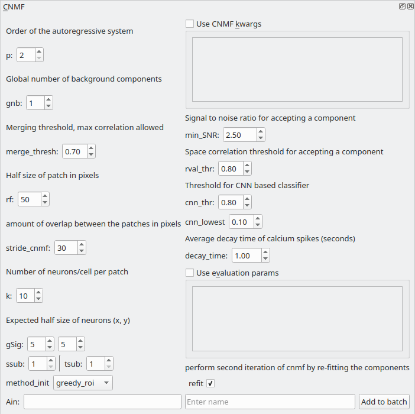

.. _module_CNMF:

CNMF
****

Perform CNMF using the implementation provided by the CaImAn library. This modules basically provides a GUI for parameter entry.

**I highly recommend going through the following before using this module**
        
    - CNMFE builds upon CNMF
        `Pnevmatikakis, E. A., Gao, Y., Soudry, D., Pfau, D., Lacefield, C., Poskanzer, K., … Paninski, L. (2014). A structured matrix factorization framework for large scale calcium imaging data analysis, 1–16. <https://arxiv.org/abs/1409.2903>`_
        
        
        `Pnevmatikakis, E. A., Soudry, D., Gao, Y., Machado, T. A., Merel, J., Pfau, D., … Paninski, L. (2016). Simultaneous Denoising, Deconvolution, and Demixing of Calcium Imaging Data. Neuron, 89(2), 285. <https://doi.org/10.1016/j.neuron.2015.11.037>`_
    
    - CaImAn demo notebook, the implementation in Mesmerize is basically from the demo. The second half of the notebook describes CNMF
        https://github.com/flatironinstitute/CaImAn/blob/master/demos/notebooks/demo_pipeline.ipynb

**Parameters**

Please see the CaImAn demo notebook mentioned above to understand the parameters. The Caiman docs also provide descriptions of the parameters: https://caiman.readthedocs.io/

You can also enter parameters for CNMF and component evaluation as keyword arguments (kwargs) in the the respective text boxes if you select "Use CNMF kwrags" or "Use evaluation params". This is useful if you want to enter parameters that cannot be entered in the GUI for example. **Use single quotes if you want to enter string kwargs, do not use double quotes.**

Usage
=====

This module adds a "CNMF" *item* to the batch. Set the desired parameters (see Caiman docs & demos) and then enter a name to add it as an *item* to the batch. After the batch item is processed, **double-click the batch item** to import the CNMF output into a Viewer. You can then annotate and curate ROIs, and add the data as a *Sample* to your project.

.. seealso:: This modules uses the :ref:`Batch Manager <module_BatchManager>`.

.. warning:: It's recommended to open a new Viewer when you want to import 3D CNMF data. Full garbage collection of 3D data in the Viewer Work environment is a WIP for when you want to clear & import 3D data into the same viewer. However when you close the Viewer entirely it is garbage collected entirely.

.. note:: The parameters used for CNMF are stored in the work environment of the viewer and this log is carried over and saved in *Project Samples* as well. To see the parameters that were used for CNMF in the viewer, execute ``get_workEnv().history_trace`` in the viewer console and look for the 'cnmf' entry.

.. warning:: Importing several *thousands* of ROIs into the Viewer can take 15-30 minutes. You will be able to track the progress of the import in the Viewer Window's status bar.

.. warning:: If you're using Windows, large `memmap` files will linger in your batch dir or work dir, you can clean them out periodically.

Script usage
============

A script can be used to add CNMF batch items. This is much faster than using the GUI. This example sets the work environment from the output of a batch item. See the :ref:`Caiman Motion Correction script usage examples <MotCorScripts>` for how to load images if you want to add CNMF items from images that are not in a batch.

.. seealso:: :ref:`Script Editor <module_ScriptEditor>`

.. code-block:: python
    :linenos:
    
    def reset_params():
        # CNMF Params that we will use for each item
        cnmf_kwargs = \
        {
            'p': 2, 
            'gnb': 1, 
            'merge_thresh': 0.25, 
            'rf': 70, 
            'stride': 40, 
            'k': 16, 
            'gSig': (8, 8), 
            'gSiz': (33, 33)
        }
        
        # component evaluation params
        eval_kwargs = \
        {
            'min_SNR': 2.5, 
            'rval_thr': 0.8, 
            'min_cnn_thr': 0.8,
            'cnn_lowest': 0.1,
            'decay_time': 2.0, 
        }
        
        # the dict that will be passed to the mesmerize caiman module
        params = \
        {
            "cnmf_kwargs":  cnmf_kwargs,
            "eval_kwargs":  eval_kwargs,
            "refit":        True,  # if you want to perform a refit
            "item_name":    "will set later per file",
        }
        
        return params

    # Get the batch manager
    bm = get_batch_manager()
    cnmf_mod = get_module('cnmf', hide=True)
    
    # Start index if we want to start processing the new items after they have been added
    start_ix = bm.df.index.size + 1
    
    # This example uses motion corrected output items from the batch manager
    # You can also open image files directly from disk, see the motion correction
    # script examples to see how to open images from disk.
    for ix, r in bm.df.iterrows():
        # Use output of items 6 - 12
        # for example if items 6 - 12 were motion correction items
        if ix < 6:
            continue
        if ix > 12: # You need to set a break point, else the batch grows infinitely
            break
        
        # get the first variant of params
        params = reset_parmas()
        
        # Get the name of the mot cor item
        name = r['name']
        
        # Set the name for the new cnmf item
        params['item_name'] = name
        
        # Load the mot cor output
        bm.load_item_output(module='caiman_motion_correction', viewers=viewer, UUID=r['uuid'])
        
        # Set the sampling rate of the data
        params['eval_kwargs']['fr'] = vi.viewer.workEnv.imgdata.meta['fps']
        
        # Get the border_pix value from the motion correction output
        # skip this if loading files that don't have NaNs on the image borders
        history_trace = vi.viewer.workEnv.history_trace
        border_pix = next(d for ix, d in enumerate(history_trace) if 'caiman_motion_correction' in d)['caiman_motion_correction']['bord_px']
        
        # Set the border_pix values
        params['border_pix'] = border_pix
        params['cnmf_kwargs']['border_pix'] = border_pix
        
        # Add to batch
        cnmf_mod.add_to_batch(params)
        
        # change some of the params and add this variant to batch
        params['cnmf_kwargs']['gSig'] = (10, 10)
        params['cnmf_kwargs']['gSiz'] = (41, 41)
        
        # Add to batch with this params variant
        cnmf_mod.add_to_batch(params)
        
        # another parameter variant
        params['eval_kwargs']['rval_thr'] = 0.7
        params['eval_kwargs']['min_cnn_thr'] = 0.65
        
        # Add to batch with this params variant
        cnmf_mod.add_to_batch(params)
    
    # Cleanup the work environment
    vi._clear_workEnv()
    
    # Uncomment the last two lines to start the batch as well
    #bm.process_batch(start_ix, clear_viewers=True)
    
