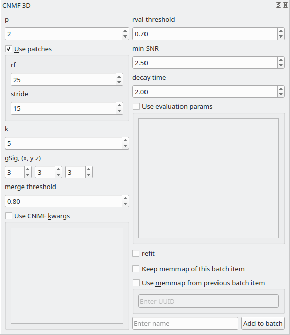

.. _module_CNMF_3D:

CNMF 3D
*******

Perform 3D CNMF using the implementation provided by the CaImAn library. This modules basically provides a GUI for parameter entry.

**I highly recommend going through the following before using this module**
        
    - CNMFE builds upon CNMF
        `Pnevmatikakis, E. A., Gao, Y., Soudry, D., Pfau, D., Lacefield, C., Poskanzer, K., … Paninski, L. (2014). A structured matrix factorization framework for large scale calcium imaging data analysis, 1–16. <https://arxiv.org/abs/1409.2903>`_
        
        
        `Pnevmatikakis, E. A., Soudry, D., Gao, Y., Machado, T. A., Merel, J., Pfau, D., … Paninski, L. (2016). Simultaneous Denoising, Deconvolution, and Demixing of Calcium Imaging Data. Neuron, 89(2), 285. <https://doi.org/10.1016/j.neuron.2015.11.037>`_
    
    - CaImAn demo notebook, the implementation in Mesmerize is basically from the demo.
        https://github.com/flatironinstitute/CaImAn/blob/master/demos/notebooks/demo_caiman_cnmf_3D.ipynb

**Parameters**

Please see the CaImAn demo notebook mentioned above to understand the parameters. The Caiman docs also provide descriptions of the parameters: https://caiman.readthedocs.io/

You can also enter parameters for CNMF and component evaluation as keyword arguments (kwargs) in the the respective text boxes if you select "Use CNMF kwrags" or "Use evaluation params". This is useful if you want to enter parameters that cannot be entered in the GUI for example. **Use single quotes if you want to enter string kwargs, do not use double quotes.**

.. note:: The parameters used for 3D CNMF are stored in the work environment of the viewer and this log is carried over and saved in *Project Samples* as well. To see the parameters that were used for 3D CNMF in the viewer, execute ``get_workEnv().history_trace`` in the viewer console and look for the 'cnmf_3d' entry.

Script Usage
============

A script can be used to add CNMF batch items. This is much faster than using the GUI. This example sets the work environment from the output of a batch item.

.. seealso:: :ref:`Script Editor <module_ScriptEditor>`

This example loads 3D sequences from disk & adds them to a batch with 3 parameter variants.

.. code-block:: python
    :linenos:
    
    # just so we can reset the params for each new image file
    def reset_params():
        # CNMF Params that we will use for each item
        cnmf_kwargs = \
        {
            'p': 2, 
            'merge_thresh': 0.8, 
            'k': 50, 
            'gSig': (10, 10, 1),
            'gSiz': (41, 41, 4)
        }
        
        # component evaluation params
        eval_kwargs = \
        {
            'min_SNR': 3.0, 
            'rval_thr': 0.75, 
            'decay_time': 1.0, 
        }
        
        # the dict that will be passed to the mesmerize caiman module
        params = \
        {
            "cnmf_kwargs":  cnmf_kwargs,
            "eval_kwargs":  eval_kwargs,
            "refit":        True,  # if you want to perform a refit
            "item_name":    "will set later per file",
            "use_patches":  False,
            "use_memmap":   False,  # re-use the memmap from a previous batch item, reduces computation time
            "memmap_uuid:   None,   # UUID (as a str) of the batch item to use the memmap from
            "keep_memmmap": False   # keep the memmap of this batch item
            
        }
        
        return params

    # get the 3d cnmf module
    cnmf_mod = get_module('cnmf_3d', hide=True)
    
    # Path to the dir containing images
    files = glob("/full_path_to_raw_images/*.tiff")
    # Sort in alphabetical order (should also work for numbers)
    files.sort()

    # Open each file, crop, and add to batch with 3 diff mot cor params
    for i, path in enumerate(files):
        print("Working on file " + str(i + 1) + " / " + str(len(files)))
        
        # get json file path for the meta data
        meta_path = path[:-5] + ".json"
        
        # Create a new work environment with this image sequence
        vi.viewer.workEnv = ViewerWorkEnv.from_tiff(path=path,           # tiff file path
                                                    method='imread',     # use imread
                                                    meta_path=meta_path, # json metadata file path
                                                    axes_order=None)     # default axes order
                                                                         # see Mesmerize Tiff file module docs for more info on axes order
        
        # update the work environment
        vi.update_workEnv()
        
        # get the first variant of params
        params = reset_parmas()
        
        # Set name for this video file
        name = os.path.basename(path)[:-5]
        params["item_name"] = name
        
        # add batch item with one variant of params
        u = cnmf_mod.add_to_batch(params)
        
        # add the same image but change some params
        params["cnmf_kwargs"]["gSig"] = (12, 12, 1)
        params["eval_kwargs"]["min_SNR"] = 2.5
        
        # use the same memmap as the previous batch item
        # since it's the same image
        params["use_memmap"] = True
        params["memmap_uuid"] = str(u)
        
        # add this param variant to the batch
        cnmf_mod.add_to_batch(params)
        
        # one more variant of params
        params["eval_kwargs"]["min_SNR"] = 2.0
        
        # add this param variant to the batch
        cnmf_mod.add_to_batch(params)
