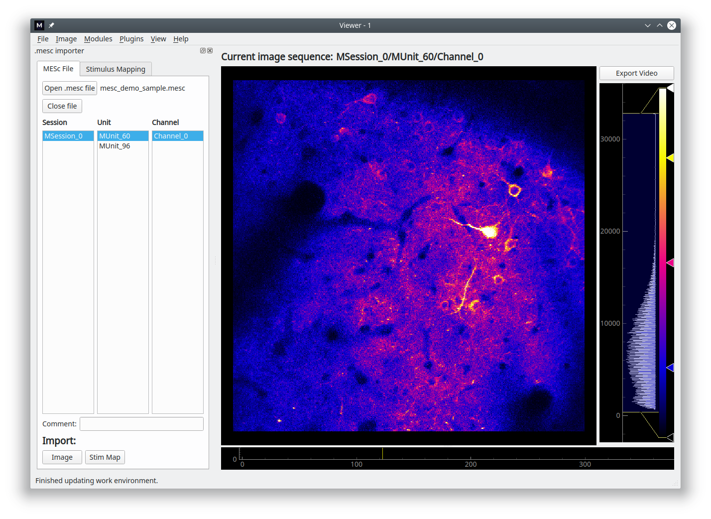
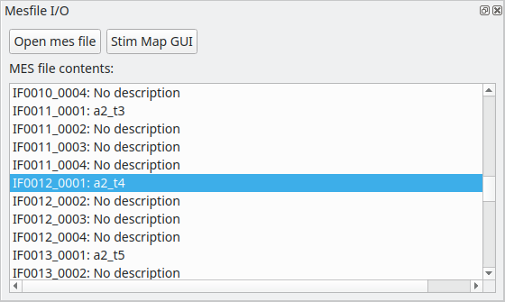
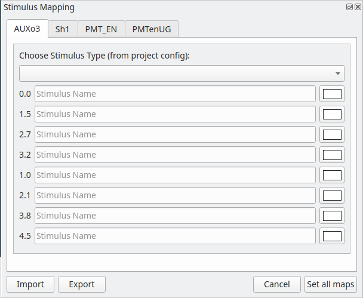

.. _FemtonicsImporters:

Femtonics Importers
*******************

You can import ``.mes`` and ``.mesc`` files containing data recorded by a Femtonics microscope. Access these modules in Viewer through Modules -> Load images -> Femtonics

mesc files
==========

You can explore the contents of a ``.mesc`` file using the module's GUI show on the left in the image below. To load a recording just double click on a selection under *Channel*. If the recording is an image sequence it will be imported into the Viewer. If the recording is a Curve a plot will open in a new window to display the curve.

mes files
=========

You can import recordings from a ``.mes`` using this module, and you can also map metadata from the microscope to specific stimuli.

To load an image sequence into the Viewer work environment, just double click the desired recording from the list.

You can map voltage data from various microscope channels (such as auxiliary outputs) to specific stimuli. The stimulus types which you can choose from will correspond to the Stimulus Type columns in your :ref:`Project Configuration <StimulusTypeColumns>`. You can view & edit the imported stimulus data using the :ref:`Stimulus Mapping Module <module_StimulusMapping>`

