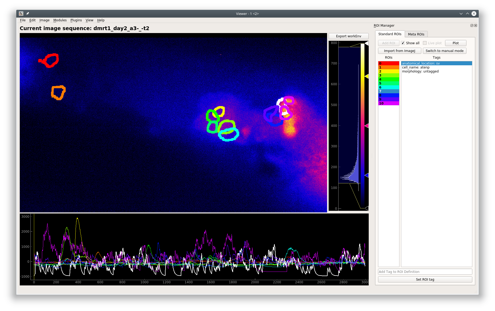

.. _ROIManager:

ROI Manager
***********

:ref:`API Reference <API_ROIManager>`

**Manage and annotate ROIs**

The ROI Manager has a manual mode, to draw ROIs manually, and a CNMF(E) mode where ROIs can be imported from CNMF(E) outputs.

.. seealso:: :ref:`CNMF <module_CNMF>`, :ref:`CNMF 3D <module_CNMF_3D>`, and :ref:`CNMFE <module_CNMFE>`.

.. note:: You cannot combine manual and CNMF(E) ROIs in the same sample.

The ImageJ ROI import uses the read-roi package by Hadrien Mary https://pypi.org/project/read-roi/

Video Tutorial
==============

.. raw:: html

    <iframe width="560" height="315" src="https://www.youtube.com/embed/0iWV7NRock4" frameborder="0" allow="accelerometer; autoplay; encrypted-media; gyroscope; picture-in-picture" allowfullscreen></iframe>

    
Layout
======

.. image:: ./roi_manager.png

**Controls**

========================    ==========================================
UI                          Description
========================    ==========================================
Add ROI button              Add Polygon ROI (Manual mode)

                            | Right click this button to add an elliptical ROI
                            
Show all                    Show all ROIs in the viewer
Live plot                   Live update of the curve plot with changes (Manual mode)
Plot                        Plot the curves (Manual mode)
Import from ImageJ          Import ROIs from an ImageJ ROIs zip file (Manual mode)
Switch to manual ...        Switch to Manual mode. Clears CNMF(E) ROIs.

ROIs list                   Color-coded list of ROIs.

                            | Left click to highlight the ROI in the viewer
                            
                            | Right click to show the context menu allowing you to delete the selected ROI
                            
Tags list                   List of tags for the selected ROI

                            | Correspond to the :ref:`ROI Type Columns of the Project Configuration <ROITypeColumns>`
                            
Add Tag to ROI Def...       Set the tag for the current selection in the Tags list
Set ROI Tag                 Click to set the tag, or just press return in the text entry above
========================    ==========================================

.. note:: It is generally advisable to keep your ROI tags short with lowercase letters. When sharing your project you can provide a mapping for all your keys. This helps maintain consistency throughout your project and makes the data more readable.

.. note:: When using 3D data, the ROIs are colored randomly along the list (not linearly as shown in the image). If you want to set the colors linearly call this in the Viewer Console: ``get_workEnv().roi_manager.roi_list.reindex_colormap(random_shuffle=False)``

.. warning:: Importing several *thousands* of ROIs can take 15-30 minutes. You will be able to track the progress of the import in the Viewer Window's status bar.

**Keyboard shortcuts**.

These only work when the ROI manager is docked within the Viewer and while you are typing in the *Add Tag to ROI Definition* text entry.

=============    ==========================================
Key                 Description
=============    ==========================================
Page Up             Select previous ROI
Page Down           Select next ROI
Right Arrow         Play the video at high speed
Left Arrow          Play the video backwards at high speed
Home                Go to the beginning of the video
End                 Go to the end of the video
=============    ==========================================

Manual ROI Mode
===============

When you click the "Add ROI" button to add a Manual Polygon ROI, a new rectangular ROI will be add in the top left corner of the image. You can add new vertices to this polygon by clicking on any of its edges. You can drag the vertices to change the shape of the polygon, and you can drag the entire ROI as well by clicking and dragging within the ROI region. Similarly you can reshape elliptical ROIs.

Hovering over the ROI selects it in the ROI list.

Console
=======

.. include:: ../../../api_reference/viewer_modules/roi_manager_api_examples.rst
