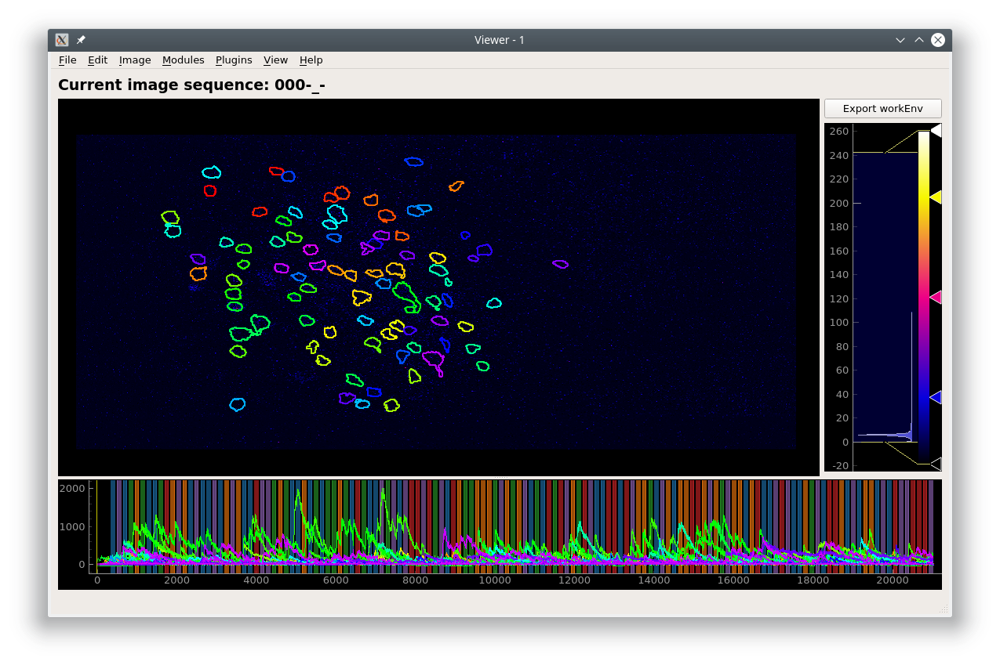

.. _module_StimulusMapping:

Stimulus Mapping
****************

:ref:`API Reference <module_StimulusMapping>`

**Map temporal information such as stimulus or behavioral periods.**

Stimulus Mapping Module

.. image:: ./stim_maps_module.png

Stimulus periods illustrated on the viewer timeline

The tabs that are available in the stimulus mapping module corresponds to the stimulus types in your :ref:`Project Configuration<StimulusTypeColums>`.

You can add stimulus periods either manually or through a script.

Manual Annotation
=================

#. To add a stimulus manually click the "Add Row" button. This will add an empty row to the current tab page.

#. Enter a name for the stimulus, start time, end time, and pick a color for illustrating the stimulus periods on the Viewer timeline.

#. To remove a stimulus click the "Remove stim" button. Stimulus periods do not have to be added in chronological order.

#. Click "Set all maps" to set the mappings for all stimulus types. You can then choose to illustrate a stimulus on the viewer timeline by selecting it from "Show on timeline"

Import and Export are not implemented yet.

.. warning:: At the moment, only "frames" are properly supported for the time units.

Script
======

.. seealso:: :ref:`API Reference <module_StimulusMapping>`

You can also use the :ref:`Stimulus Mapping module's API <module_StimulusMapping>` to set the stimulus mappings from a pandas DataFrame.

This example creates a pandas DataFrame from a csv file to set the stimulus mappings. It uses the csv file from the pvc-7 dataset availble on CRCNS: http://dx.doi.org/10.6080/K0C8276G

You can also download the csv here: :download:`stimulus_pvc7.csv <./stimulus_pvc7.csv>`

.. code-block:: python
    :linenos:

    import pandas as pd
    from mesmerize.plotting.utils import get_colormap

    # Load dataframe from CSV
    df = pd.read_csv('/share/data/longterm/4/kushal/crcns_datasets/pvc-7/122008_140124_windowmix/stimulus.csv')

    # Sort according to time (stimulus "start" frame column)
    df.sort_values(by='start').reset_index(drop=True, inplace=True)

    # Trim off the periods that are not in the current image sequence
    # This is just because this example doesn't use the whole experiment
    trim = get_image().shape[2]
    df = df[df['start'] <= trim]

    # Remove the unused columns
    df.drop(columns=['sf', 'tf', 'contrast'])

    # Rename the stimulus column of interest to "name"
    df.rename(columns={'ori': 'name'}, inplace=True)

    # Get the names of the stimulus periods to create a colormap for illustration in the curves plot area
    oris = df['name'].unique()
    oris.sort()

    # Create colormap to visualize the stimuli in the viewer's curve plots area
    oris_cmap = get_colormap(oris, 'tab10', output='pyqt', alpha=0.6)

    # Create a column with colors that correspond to the orientations column values
    df['color'] = df['name'].map(oris_cmap)

    # name column must be str type for stimulus mapping module
    # the ori data from the original csv is integers so you must change it
    df['name'] = df['name'].apply(str)

    # Get the stimulus mapping module
    smm = get_module('stimulus_mapping')

    # Set the ori colormap
    smm.maps['ori'].set_data(df)
