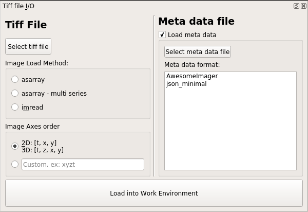

.. _module_TiffFile:

Tiff file module
****************

To open a tiff file go to Modules -> Load Images -> Tiff files.

.. note:: You can also use this module through the console and scripts. See :ref:`Tiff module API <API_TiffModule>`.

To open tiff files first click the “Select file” button and choose your file. You can also drag and drop a tiff file (drag and drop doesn't work properly on Windows).

Next, you must select an appropriate Image Load Method (see next section). You can also import meta data associated with your recording.

**Certain meta data, such as the sampling rate of the data, are necessary for some downstream analysis procedures.** There are a few ways to import your meta data into the Viewer Work Environment:

    - Simple JSON files, see *json_minimal* under the table in the :ref:`Meta data <module_TiffFile_MetaData>` section
    
    - Define your own :ref:`Custom functions <module_TiffFile_CustomFunctions>` to open meta in other file formats
    
    - Manually create a meta data dictionary using the :ref:`Console <module_TiffFile_Console>`

Load Method
===========

The options for "Load Method" correspond to the `tifffile <https://pypi.org/project/tifffile/>`_ library method that is used for loading the images.

If you are not sure which method you should use, try all of them and see which one loads your data appropriately. If none of them work, `create an issue on GitHub <https://github.com/kushalkolar/MESmerize/issues/new>`_.

    - **asarray:** Should work for most tiff files, fast method

    - **asarray - multi series:** Also fast. Use this if it is a multi-page tiff. For example if the tiff file was created by a program that appends each frame to a file as they are being acquired by the camera.
    
    - **imread:** Usually slower, should work for most tiff files.

Axes order
==========

Choose the default axes order or manually enter the axes order if your tiff file uses a different order.

.. _module_TiffFile_MetaData:

Meta data
=========

Check the "Load meta data" checkbox if you want to load meta data. Alternatively, you can uncheck this box and create a meta data dictionary manually using the console (see the :ref:`Console <module_TiffFile_Console>` section)

You can select a meta data format from the list. This list of formats correspond to the functions available in the module: ``mesmerize.viewer.core.organize_meta``.
When you select a meta data format, it will automatically try to find a file with the extension specified by the selected format if it has the same name as the selected tiff file.

If you have questions on meta data formats feel free to drop a message in the `Gitter room <https://gitter.im/mesmerize_discussion/community?utm_source=share-link&utm_medium=link&utm_campaign=share-link>`_
 
**Default list of formats that are recognized:**

    ====================    =========   ====================================================
    Name                    extension   Description
    ====================    =========   ====================================================
    json_minimal            .json       Recognizes a json file that contains at least the minimal set of necessary keys: ``origin``, ``fps`` and ``date``.
    
                                        | All other keys in the JSON file are placed in a sub-dictionary with the key ``orig_meta``
                                        
                                        | See :ref:`Minimal dict <module_TiffFile_MinimalDict>` below for more info.

    AwesomeImager           .json       Used for 1p imaging in the `Chatzigeorgiou group <https://www.chatzigeorgioulab.com>`_ at the `Sars Center <https://www.uib.no/en/sarssenteret>`_

    ome_tiff                .tiff       Imports OME XML meta data stored within the tiff file. Specification is described here: https://docs.openmicroscopy.org/ome-model/6.2.2/ome-tiff/specification.html

                                        The following values are computed and added to the meta data for the :ref:`Viewer Work Environment <ViewerWorkEnv>`, and can be accessed through ``get_meta()`` in the :ref:`Viewer Console <ViewerConsole>`

                                        | ``fps`` - mean sampling rate in Hz, volumetric sampling rate if 3D, frame-to-frame sampling rate if 2D

                                        | ``fps_std`` - standard deviation of the sampling rate

                                        | ``fps_max_dev`` - maximum deviation from the mean sampling rate

                                        | A warning box is shown if ``fps_std`` > 0.01 or ``fps_max_dev`` > 0.1
    ====================    =========   ====================================================

    
.. _module_TiffFile_CustomFunctions:

Custom functions
----------------

You may define your own function to organize your meta data. It MUST return a dict which has at least the following keys: ``origin``, ``fps`` and ``date``.

    - ``origin`` is a ``str`` describing the software or microscope the recording comes from. This is for your own record.
    
    - ``fps`` is the sampling rate of the recording as a ``float`` or ``int``
    
    - ``date`` is the date & time represented by a ``str`` in the following format: ``"YYYYMMDD_HHMMSS"``

In addition to these 3 keys, you may include any additional keys as you wish.

If you think your meta data organizing function will be useful for others I'll be happy to review a pull request and it can be included by default in Mesmerize. We're happy help you create a meta data function, just contact us on `Gitter <https://gitter.im/mesmerize_discussion/community?utm_source=share-link&utm_medium=link&utm_campaign=share-link>`_ or `create an issue on GitHub <https://github.com/kushalkolar/MESmerize/issues/new>`_.

.. _module_TiffFile_MinimalDict:

Minimal dict
^^^^^^^^^^^^

Example of a minimal meta data dict.

.. code-block:: python

    {
        "origin": "microscope or software origin",  # must be a str
        "fps":     10.0,                            # must be a int or float
        "date":    "20201123_172345"                # must be a str formatted as "YYYYMMDD_HHMMSS"
    }
    
Function outline
^^^^^^^^^^^^^^^^

Basic outline of a function that you can add to ``mesmerize.viewer.core.organize_meta`` for organizing your meta data:

    #. The function can only take the ``path`` to the meta data file as the argument.
    #. The expected file extension for the meta data must be specified. The files of a single format are allowed to have multiple different file extension but you must only specify the most common one.
    #. The function would generally open the meta data file specified by the ``path``, using any python libraries or other code of your choice, and finally return a dictionary that contains the minimal complement of keys, i.e. ``origin``, ``fps`` and ``date`` with values of the appropriate types (see previous section).

.. code-block:: python

    def my_meta_organizer(path: str) -> dict:
        """.ext""" # define the file ext in the docstring
        
        raw_meta = function_to_load_my_file(path)

        # do stuff to organize the raw_meta

        meta = ... # stuff to organize raw meta
        return meta
        # return the organized meta data dict
        # that mesmerize can use

.. _module_TiffFile_Console:

Console/Script usage
====================

You can also load tiff files through the :ref:`Viewer Console <ViewerConsole>` or :ref:`Script Editor <module_ScriptEditor>`.

This example can be run line-by-line through the :ref:`Viewer Console <ViewerConsole>`, or from the :ref:`Script Editor <module_ScriptEditor>`.

.. code-block:: python
    :linenos:

    image_path = # path to tiff file
    meta_path = # path to json meta data file
    
    clear_workEnv() # Prevents a confirmation dialog from appearing
    
    # Get the tiff module
    tio = get_module('tiff_io', hide=True)
    
    # Load the tiff file
    tio.load(image_path, method='imread', axes_order='txy', meta_path=meta_path, meta_format='json_minimal)

**Alternatively, you may manually create a meta data dictionary after loading a tiff file:**

.. code-block:: python
    :linenos:
    
    image_path = # path to tiff file
    
    clear_workEnv() # Prevents a confirmation dialog from appearing
    
    # Get the tiff module
    tio = get_module('tiff_io', hide=True)
    
    # Load the tiff file
    tio.load(image_path, method='imread', axes_order='txy')
    
    meta_dict = \
        {
            "origin":   "my_microscope_software",   # must a str
            "fps":      17.25,                      # must be a int or float
            "date"      "20201123_172345"           # must be a str formatted as "YYYYMMDD_HHMMSS"/
        }
    
    get_workEnv().imgdata.meta = meta_dict

    
.. seealso:: :ref:`Tiff module API <API_TiffModule>`, :ref:`Viewer Core API <API_ViewerCore>`, :ref:`Overview on consoles <ConsoleOverview>`
