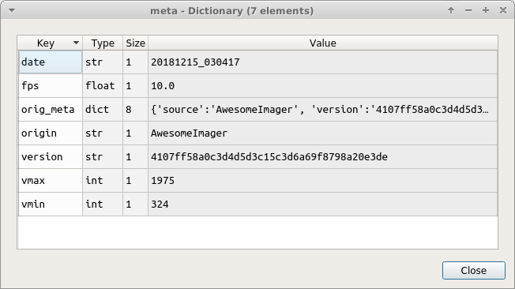
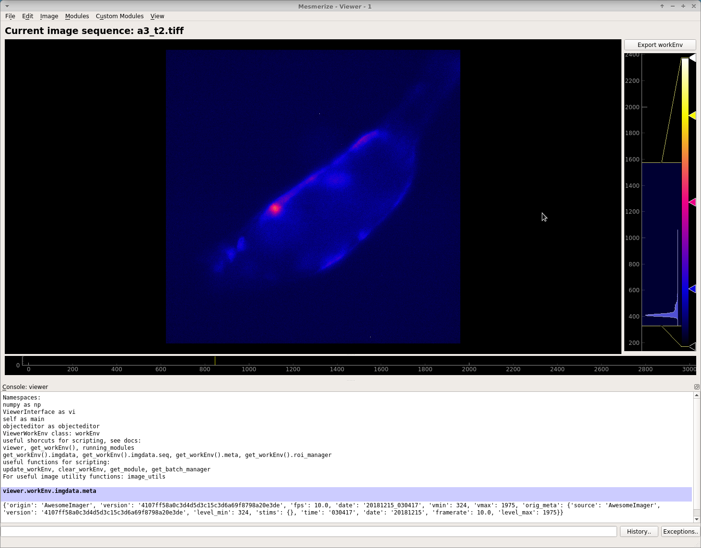

.. _ViewerOverview:

Viewer overview
***************

Based on the `pyqtgraph ImageView <http://www.pyqtgraph.org/documentation/widgets/imageview.html>`_ widget.

**The Viewer allows you to do the following things:**

* Examine your calcium movies
* Use modules to perform things like motion correction, CNMF(E), ROI labeling, and stimulus mapping. See their respective guides for details.
* You can also make modifications to an existing Sample in your project by opening it in the Viewer. See Modify Sample and Overwrite guide.

Layout
======

.. image:: ./overview/1.png

To access Viewer modules choose the module you want to run from the Modules menu at the top. All modules, except the Batch Manager, are small floating windows which you can dock into the Viewer by dragging them to an edge of the viewer.

3D data
-------

When viewing 3D data a slider on the left allows you to move through the z axis.

.. image:: ./overview/viewer_3d.png

The image stack shown above is from Martin Haesemeyer's dataset from the following paper:

    Haesemeyer M, Robson DN, Li JM, Schier AF, Engert F. A Brain-wide Circuit Model of Heat-Evoked Swimming Behavior in Larval Zebrafish. Neuron. 2018;98(4):817-831.e6. doi:10.1016/j.neuron.2018.04.013

.. _ViewerWorkEnv:

Work Environment
================

Everything in the viewer is stored in a Work Environment object. The main data attributes of the viewer work environment are outlined below.

.. seealso:: :ref:`ViewerWorkEnv API <API_ViewerWorkEnv>`

==================  =============================================================
Attribute           Description
==================  =============================================================
imgdata             :ref:`ImgData object <API_ImgData>` containing the Image Sequence and meta data from the imaging source
roi_manager         The back-end :ref:`ROI Manager <API_ROIManagers>` that is currently in use
sample_id           SampleID, if opened from a project Sample
stim_maps           Stimulus maps, if any are defined
history_trace       History log, currently used for logging :ref:`caiman motion correction <module_CaimanMotionCorrection>`, :ref:`CNMF <module_CNMF>` and :ref:`CNMFE <module_CNMFE>` history.
UUID                If opened from a project Sample, it refers to the ImgUUID
==================  =============================================================

You can view everything in the current work environment by going to View -> Work Environment Editor. You cannot edit through this GUI at this time.

Menubar
=======

File
----

Add to Project
^^^^^^^^^^^^^^

Add the current :ref:`work environment <ViewerWorkEnv>` as a Sample to the project.

Open Work Environment
^^^^^^^^^^^^^^^^^^^^^

Deprecated

Save Work Environment
^^^^^^^^^^^^^^^^^^^^^

Deprecated

Clear Work Environment
^^^^^^^^^^^^^^^^^^^^^^

Clear the current :ref:`work environment <ViewerWorkEnv>`. Useful for freeing up RAM.

Edit
----

Deprecated

Image
-----

Reset Scale
^^^^^^^^^^^

Reset the scale of the image ViewBox

Resize
^^^^^^

Resize the image sequence using interpolation.

Crop
^^^^

Crop the image sequence. 

**Usage**

#. When you click this option a square crop region will appear in the top left corner of the image sequence.

#. You can change its shape using the handle in the bottom right corner.

#. To crop to the selection, in the menubar go to Image -> Crop. To cancel cropping right click in the crop region and click "Remove ROI".

Measure
^^^^^^^

Measure the distance (in pixels) between two points in the image sequence.

**Usage**

#. After clicking this option in the menubar, click on a point in the image sequence. You will not see anything yet.

#. Click on a second point in the image sequence, a line will appear connecting the first and second points that you clicked.

#. You can use the handles at the endpoints of the line to change the line.

#. To measure the distance of the line go to Image -> Measure. A window will pop up displaying the change in x, y, and length of the line in pixels.

Change dtype
^^^^^^^^^^^^

Not implemented yet. You can change the dtype through the console.

Projections
^^^^^^^^^^^

View Mean, Max, and Standard Deviation projections of the current image sequence in the work environment. If the data are 3D, the projection is of the current plane.

Modules
-------

Default Viewer Modules. These are explained in more details in the Viewer Modules chapters.

Plugins
-------

Custom viewer modules.

View
----

Work Envionment Editor
^^^^^^^^^^^^^^^^^^^^^^

Explore the data in your work environment using a GUI.

.. image:: ./overview/8.png

.. note:: This is read only, you cannot edit via this GUI.

For example if you want to see your meta data, double click on “imgdata” and then you can see that “imgdata” has two things, the image sequence (i.e. your video) and the meta data.
    
.. image:: ./overview/9.png

If you double click on “meta” above you can see your meta data.

You can view your meta data more quickly using the console.

Open the console by going to View -> Console.
You can then call ``get_meta()`` to print the meta data dict.

Console
^^^^^^^

View/hide the viewer console

Help
----

Open docs
^^^^^^^^^

Open these docs

.. _ViewerConsole:

Console
=======

You can interact directly with the :ref:`work environment <ViewerWorkEnv>` using the console.

.. seealso:: :ref:`Viewer Core API <API_ViewerCore>`, :ref:`Overview on consoles <ConsoleOverview>`

Namespace
---------

=====================   ====================================================================
Reference               Description
=====================   ====================================================================
vi                      Instance of :ref:`ViewerUtils <API_ViewerUtils>`. Use this to interact with the viewer.
all_modules             List all available modules (includes default and any available plugins/custom modules)
ViewerWorkEnv           Use for creating new instances of :ref:`ViewerWorkEnv <API_ViewerWorkEnv>`
ImgData                 Use for creating new instances of :ref:`ImgData <API_ImgData>`
get_workEnv()           Get the current viewer :ref:`work environment <ViewerWorkEnv>` (instance of :ref:`ViewerWorkEnv <API_ViewerWorkEnv>`)
get_image()             Get the current image sequence (returns current :ref:`ViewerWorkEnv.imgdata.seq <API_ViewerWorkEnv>`). If the data are 3D it returns the current plane only.
get_meta()              Get the current meta data
get_module(<name>)      Pass the name of a module as a string. Returns that module if it is available.
get_batch_manager()     Get the batch manager.
update_workEnv()        Update the viewer GUI with the viewer work environment (vi.viewer.workEnv)
clear_workEnv()         Clear the current work envionment, cleanup the GUI and free the RAM
=====================   ====================================================================

Examples
--------

View meta data
^^^^^^^^^^^^^^

.. code-block:: python

    >>> get_meta()
    
    {'origin': 'AwesomeImager', 'version': '4107ff58a0c3d4d5d3c15c3d6a69f8798a20e3de', 'fps': 10.0, 'date': '20190426_152034', 'vmin': 323, 'vmax': 1529, 'orig_meta': {'source': 'AwesomeImager', 'version': '4107ff58a0c3d4d5d3c15c3d6a69f8798a20e3de', 'level_min': 323, 'stims': {}, 'time': '152034', 'date': '20190426', 'framerate': 10.0, 'level_max': 1529}}

View history trace
^^^^^^^^^^^^^^^^^^

.. code-block:: python

    >>> get_workEnv().history_trace
    
    [{'caiman_motion_correction': {'max_shifts_x': 32, 'max_shifts_y': 32, 'iters_rigid': 1, 'name_rigid': 'Does not matter', 'max_dev': 20, 'strides': 196, 'overlaps': 98, 'upsample': 4, 'name_elas': 'a1_t2', 'output_bit_depth': 'Do not convert', 'bord_px': 5}}, {'cnmfe': {'Input': 'Current Work Environment', 'frate': 10.0, 'gSig': 10, 'bord_px': 5, 'min_corr': 0.9600000000000001, 'min_pnr': 10, 'min_SNR': 1, 'r_values_min': 0.7, 'decay_time': 2, 'rf': 80, 'stride': 40, 'gnb': 8, 'nb_patch': 8, 'k': 8, 'name_corr_pnr': 'a8_t1', 'name_cnmfe': 'a1_t2', 'do_corr_pnr': False, 'do_cnmfe': True}}, {'cnmfe': {'Input': 'Current Work Environment', 'frate': 10.0, 'gSig': 10, 'bord_px': 5, 'min_corr': 0.9600000000000001, 'min_pnr': 14, 'min_SNR': 1, 'r_values_min': 0.7, 'decay_time': 4, 'rf': 80, 'stride': 40, 'gnb': 8, 'nb_patch': 8, 'k': 8, 'name_corr_pnr': '', 'name_cnmfe': 'a1_t2', 'do_corr_pnr': False, 'do_cnmfe': True}}]

Open image
^^^^^^^^^^
    
**Use the :ref:`Viewer Core API <API_ViewerCore> to open any arbitrary image**

This example loads an image stored using numpy.save(), but this is applicable to images stored in any format that can eventually be represented as a numpy array in python. For example, you could also load image files stored in HDF5 format and load the numpy array that represents your image sequence.

.. code-block:: python
    :linenos:

    import numpy as np
    
    # clear the viewer work environment
    clear_workEnv()
    
    a = np.load('/path_to_image.npy')
    
    # check what the axes order is
    a.shape
    
    # (1000, 512, 512) # for example
    # looks like this is in [t, x, y]
    # this can be transposed so we get [x, y, t]
    # ImgData takes either [x, y, t] or [x, y, t, z] axes order
    
    # Define a meta data dict
    meta = \
        {
            "origin":      "Tutorial example",
            "fps":         10.0,
            "data":        "20200629_171823",
            "scanner_pos": [0, 1, 2, 3, 4, 5, 6]
        }
    
    # Create ImgData instance
    imgdata = ImgData(a.T, meta)  # use a.T to get [x, y, t]
    
    # Create a work environment instance
    work_env = ViewerWorkEnv(imgdata)
    
    # Set the current Viewer Work Environment from this new instance
    vi.viewer.workEnv = work_env
    
    # Update the viewer with the new work environment
    # this MUST be run whenever you replace the viewer work environment (the previous line)
    update_workEnv()
    
    
Splice img seq
^^^^^^^^^^^^^^

Extract the image sequence between frame 1000 and 2000. Image sequences are simply numpy arrays.

.. seealso:: `Numpy array indexing <https://docs.scipy.org/doc/numpy/reference/arrays.indexing.html>`_

.. code-block:: python
    :linenos:
    
    # Get the current image sequence
    seq = get_image()
    
    # Trim the image sequence
    trim = seq[:, :, 1000:2000]
    
    # Set the viewer work environment image sequence to the trim one
    vi.viewer.workEnv.imgdata.seq = trim
    
    # Update the GUI with the new work environment
    update_workEnv()

Running scripts
----------------

You can use the :ref:`Script Editor <module_ScriptEditor>` to run scripts in the Viewer console for automating tasks such as batch creation. It basically allows you to use the :ref:`viewer console <ViewerConsole>` more conveniently with a text editor.
