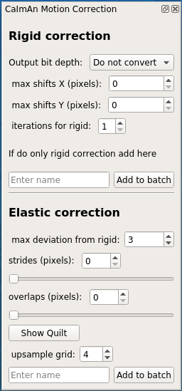
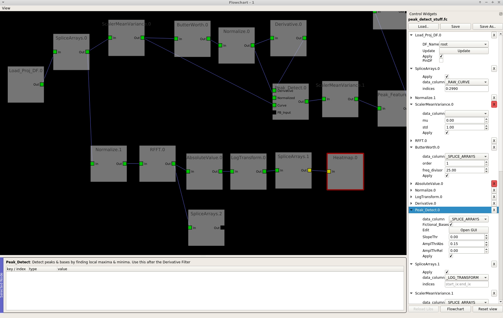

Overview
********

.. image:: ./imgs/Overview/welcome_window.png

The Viewer
^^^^^^^^^^

.. image:: ./imgs/Overview/viewer.png

Opening Image sequences
^^^^^^^^^^^^^^^^^^^^^^^

Mesmerize is able to work with 2D imaging sequences stored as tiff files and also with mes files from Femtonics microscopes. If you have image sequences stored in another format they can also be used if a Python library exists for opening them.

Stimulus mapping
^^^^^^^^^^^^^^^^

Stimulus information from mes files or CSV's can be mapped onto your imaging data.

CaImAn modules
^^^^^^^^^^^^^^

Mesmerize contains front-end GUI modules for the extremely useful and versatile CaImAn library. This makes it very easy for users without a programming background to use the library.

**CaImAn Elastic Motion Correction**

**CNMFE**

.. image:: ./imgs/Overview/cnmfe.png

The computationally intense procedures performed using the CaImAn library (Elastic Motion Correction and CNMF) can be organized using the Mesmerize Batch Manager.

Batch Manager
^^^^^^^^^^^^^

.. image:: ./imgs/Overview/batch_manager.png

Project Organization
^^^^^^^^^^^^^^^^^^^^

.. image:: ./imgs/Overview/project_browser.png

Data analysis - pyqtgraph programmable flowcharts.
^^^^^^^^^^^^^^^^^^^^^^^^^^^^^^^^^^^^^^^^^^^^^^^^^^

**Types of Nodes**

* **Data Nodes**

  * Load_Proj_DF
  * Save
  * Load

* **Plotting**

  * Simple time series
  * Heatmap

* **Categorical Filters**

  * Align Stims
  * ROI Selection
  * Genotype selection
  * Peak Detection
  * Custom columns

* **Filters and Signal Processing**

  * Butterworth filter
  * Savitzsky-Golay filter
  * Derivative
  * Resample
  * Normalize
  * Z-Score

    * **Math**

  * LogTransform
  * Discreate fourier transform
  * Inverse discrete fourier transform
  * Absolute value

* **Clustering** - based on sklearn

  * KMeans
  * Agglomerative
  * LDA

* **Transform** - based on sklearn

  * Manifold Learning

    * Isomap
    * Locally Linear Embedding
    * Spectral Embedding
    * MDS

      * **Decomposition** - based on sklearn
      * PCA

Interactive Plots
^^^^^^^^^^^^^^^^^

.. image:: ./imgs/Overview/interactive.gif
