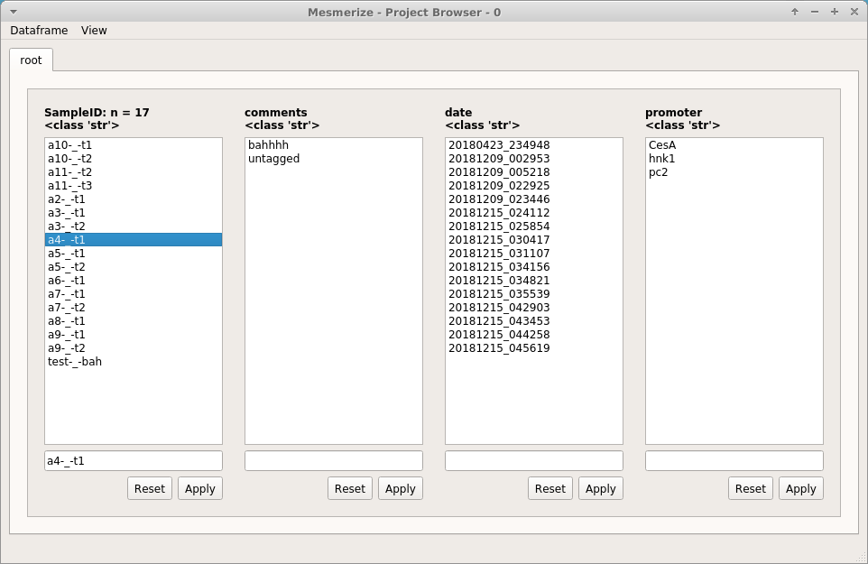
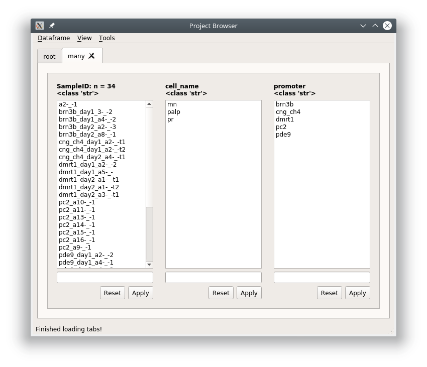

.. _ProjectBrowser:

Project Browser
***************

**Browse, edit and sort the project DataFrame**

You can open the Project Browser from the :ref:`Welcome Window <WelcomeWindow>` after you have opened a project.

The columns that are visible in the Project Browser Window correspond to the :ref:`Project Configuration <project-configuration>`. For each column you will see a list which is a set of unique elements from that column in the project DataFrame.

Functions

Open Sample
===========

Double-click on a Sample in the *SampleID* column to open it in the :ref:`Viewer <ViewerOverview>`.

In the viewer you can make changes and then save it by going to File -> Add to Project. You will see a "Save changes (overwrite)" option which will overwrite the data for this project Sample with the current data in the viewer work environment. If you have not changed the image sequence data you can uncheck the "Overwrite image data" checkbox, useful if your image sequences are large.

.. image:: ./save_changes.png

Filter
======

You can sort your Project DataFrame into different groups (such as experimental groups) using text and numerical filters. Type a filter into the text entries that are below the list of elements for a column. You can also click on one or many elements in a column to set those elements as the filters.

If you filter out of the root tab, it will always create a new tab with a name of your choice. If you filter out of any other tab it will apply the filter in-place unless you right click on the "Apply" button and choose "Apply in new tab"

Text filters
------------

Partial match
-------------

To filter out a group based on partial text matches just enter the text into the filter text entry below the column(s) of interest and click "Apply"

.. image:: ./simple_filter.png

Since this is filtering out of the root tab, you will be prompted to give a name for a new tab that will be created based on the filter you have entered.

.. image:: ./tab_name_prompt.png

The result is a DataFrame containing all rows where the cell_name contains 'aten'

.. image:: ./simple_filter_result.png

If you go to View -> Current dataframe you can see the whole dataframe.

.. thumbnail:: ./simple_filter_result_2.png

To see how the filter translates to pandas commands go to View -> Current tab filter history

.. image:: ./pandas_filter_history.png

.. _ProjectBrowserMultipleFilters:

Multiple filters
----------------

You can combine filters together by using the ``|`` seperator. The ``|`` acts as an "or" operator.

.. image:: ./filter_many.png

The result is all rows where mn, palp, or pr are in the cell_name column.

.. note:: This can be combined with :ref:`Modifiers <ProjectBrowserModifiers>`

.. _ProjectBrowserFilterMultipleColumns:

Filter multiple columns
-----------------------

You can filter multiple columns simultaneously if you are not in the root tab. You can create a new tab that is essentially the same as the root by just keeping the filter entries blank and clicking "Apply".

Filter out all rows where the cell_name column contains 'pr' and promoter column contains 'pc2' or 'cng_ch4'.

.. image:: ./multiple_columns.png

Right click on the "Apply" button and choose "Apply all" or "Apply all in new tab"

.. image:: ./multiple_columns_result.png

If you view the pandas filter history (View -> Current tab filter history) you can see that the filters for each column are simply applied sequentially.

.. image:: ./multiple_columns_filter_history.png

The dataframe

.. thumbnail:: ./multiple_columns_result_dataframe.png

.. _ProjectBrowserModifiers:

Modifiers
---------

You can perform other types of matches, such as exact matches, negations, and exact negations. Enter the filter and then right click on the text entry to see available modifiers and choose the desired modifier.

.. image:: ./modifiers_str.png

============    ===================================
Modifier        Description
============    ===================================
$NOT:           Results in the negation of partial matches
$STR:           Treats the filter as a str, same as Partial Match (see above sub-section)
$STR=:          Exact text match
$STR!=:         Negation of exact text match
============    ===================================

Numerical filters
-----------------

By default the filters in all entires are treated as text. If your column contains numerical data you have additional options for modifiers. The first four modifiers are the :ref:`same as explained above <ProjectBrowserModifiers>`. The rest are self explanatory.

.. image:: ./modfiers_num.png

Editor
======

You can view and edit the Project DataFrame directly in a GUI using the DataFrame editor.

.. thumbnail:: ./dataframe_editor.png

.. warning:: Make sure you know what you are doing when you directly modify the Project DataFrame. Changes cannot be undone but you can restore a backup from the project's :ref:`dataframe directory <ProjectStructure>`. For example, do not modify data under the following columns: CurvePath, ImgInfoPath, ImgPath, ROI_State, any uuid column.

.. seealso:: Uses the `Spyder object editor <https://docs.spyder-ide.org/variableexplorer.html?highlight=object%20editor>`_

Console
=======

If you are familiar with pandas you can interact with the project DataFrame directly. If you are unfamiliar with pandas it's very easy to learn.

.. seealso:: `Pandas documentation <https://pandas.pydata.org/pandas-docs/version/0.24/>`_

**Useful Callables**

=========================   ===================================
Callable                    Purpose
=========================   ===================================
get_dataframe()             returns dataframe of the current project browser tab
get_root_dataframe()        always returns dataframe of the root tab (entire project DataFrame)
set_root_dataframe()        pass a pandas.DataFrame instance to set it as the project DataFrame
=========================   ===================================

Usage
-----

General usage to modify the project DataFrame would be something like this:

.. code-block:: python
    
    # Get a copy the project DataFrame to modify
    df = get_root_dataframe().copy()
    
    # Do stuff to df
    ...
    
    # Set the project DataFrame with the modified one
    set_root_dataframe(df)    

Example
--------

Let's say you have been inconsistent in naming "ATENA" ROI Tags in the "cell_name" column. You can rename all occurances of 'atena' to 'ATENA'

.. code-block:: python

    # Get a copy of the project DataFrame
    >>> df = get_root_dataframe().copy()
    
    # View all occurances of 'atena'
    >>> df.cell_name[df.cell_name == 'atena']
    2      atena
    3      atena
    4      atena
    5      atena
    6      atena
    205    atena
    Name: cell_name, dtype: object
    
    # Rename all occurances of 'atena' to 'ATENA'
    >>> df.cell_name[df.cell_name == 'atena'] = 'ATENA'
    
    # Check that there are more occurances of 'atena'
    >>> df.cell_name[df.cell_name == 'atena']
    Series([], Name: cell_name, dtype: object)

    # Check that we have renamed the 'atena' occurances to 'ATENA'
    # Indices 2-6 and 205 were named 'atena'
    >>> df.cell_name
    0      untagged
    1      untagged
    2         ATENA
    3         ATENA
    4         ATENA
    5         ATENA
    6         ATENA
    7         atenp
    ...
    Name: cell_name, Length: 311, dtype: object
    
    # Check index 205
    >>> df.cell_name.iloc[205]
    'ATENA'
    
    # Finally set the changed DataFrame as the root (project) DataFrame
    >>> set_root_dataframe(df)

    
    
