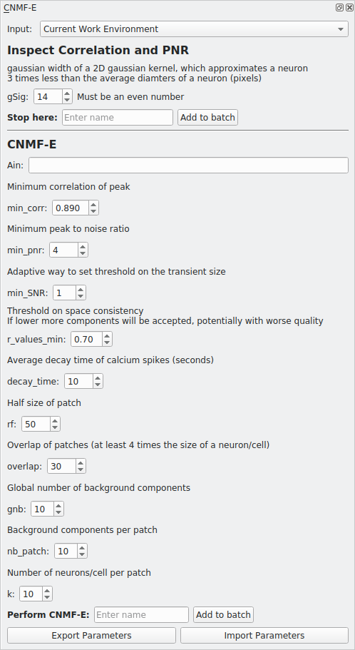

.. _module_CNMFE:

CNMFE
*****

Perform CNMFE using the implementation provided by the CaImAn library.

**I highly recommend going through the following before using this module**

    - The paper on CNMF-E
        `Zhou, P., Resendez, S. L., Rodriguez-Romaguera, J., Jimenez, J. C., Neufeld, S. Q., Stuber, G. D., … Paninski, L. (2016). Efficient and accurate extraction of in vivo calcium signals from microendoscopic video data. ELife, 1–37.  <https://doi.org/10.7554/eLife.28728>`_
        
    - CNMFE builds upon CNMF
        `Pnevmatikakis, E. A., Gao, Y., Soudry, D., Pfau, D., Lacefield, C., Poskanzer, K., … Paninski, L. (2014). A structured matrix factorization framework for large scale calcium imaging data analysis, 1–16. <https://arxiv.org/abs/1409.2903>`_
        
        
        `Pnevmatikakis, E. A., Soudry, D., Gao, Y., Machado, T. A., Merel, J., Pfau, D., … Paninski, L. (2016). Simultaneous Denoising, Deconvolution, and Demixing of Calcium Imaging Data. Neuron, 89(2), 285. <https://doi.org/10.1016/j.neuron.2015.11.037>`_
    
    - CaImAn CNMF-E demo notebook, the implementation in Mesmerize is basically from the demo
        https://github.com/flatironinstitute/CaImAn/blob/master/demos/notebooks/demo_pipeline_cnmfE.ipynb

**Parameters**

Please see the CaImAn demo notebook mentioned above to understand the parameters.

**Ain**: Seed spatial components from another CNMFE item by entering its UUID here.

Usage
=====

This module creates two types of batch items, one where you can inspect the Correlation & PNR images and another that performs CNMFE and extracts components. Here is an outline of typical usage:

#. Enter a *gSig* parameter value and a name for "Inspect Correlation and PNR", the text entry for "Stop here". Click "Add to batch". Run the batch item.

#. Double-click the batch item, you will be presented with a GUI to help optimize *min_corr* and *min_pnr*. For the correlation image use the vmin slider to optimize the seperation of cells and set the *min_corr* parameter to this value. Likewise, optimize the value for the PNR until the PNR image mostly contains regions that show real signal and no or few regions that are likely to be just noise and set this vmin value as the *min_pnr* parameter. You may need to try slightly different variations to optimize the parameters.

.. image:: ./corr_pnr_img.png

#. Enter the rest of the parameters and give a name under "Perform CNMF-E", click "Add to batch" and run the item.

#. Double-click the batch item and you will be presented with 3 options. The first option will display the correlation-pnr images and the second option is currently non-functional (matplotlib Qt issue). The last option will import the components extracted by CNMFE into an open Viewer. The components are managed by the ROI Manager.

.. seealso:: :ref:`ROI Manager <ROIManager>`

.. seealso:: This modules uses the :ref:`Batch Manager <module_BatchManager>`.

.. note:: The parameters used for CNMFE are stored in the work environment of the viewer and this log is carried over and saved in :ref:`Project Samples` as well. To see the parameters that were used for CNMFE in the viewer, execute ``get_workEnv().history_trace['cnmfe']`` in the viewer console.

Script Usage
============

A script can be used to add CNMFE batch items. This is much faster than using the GUI.

.. seealso:: `Script Editor <module_ScriptEditor>`.

