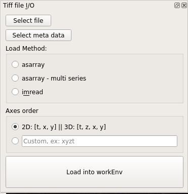
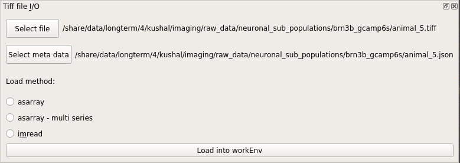

.. _module_TiffFile:

Tiff file module
****************

To open a tiff file go to Modules -> Load Images -> Tiff files.

.. note:: You can also use this module through the console and scripts. See :ref:`Tiff module API <API_TiffModule>`.

To open tiff files just click the “Select file” button and choose your file. You can also drag and drop a tiff file (drag and drop doesn't work properly on Windows).

When you choose a tiff file it will automatically find the associated .json meta data if it has the same filename.

Finally, select an appropriate load method (see next section) and click "Load into workEnv"

You specify a non-standard axes order (more information below)

.. warning:: If the name of the tiff file and .json meta data file are different, you must specify the .json meta data file using the *Select meta data* button.

.. warning:: **You cannot perform any analysis without the meta data file since you need the sampling rate of the video and it is specified in the meta data file.**

Load Method
===========

The options for "Load Method" correspond to the `tifffile <https://pypi.org/project/tifffile/>`_ library method that is used for loading the images.

If you are not sure which method you should use, try all of them and see which one loads your data appropriately. If none of them work, contact us and I may be able to add more methods.

.. note:: If you have an unsaved work environment open (such as a video with ROIs for example) it will prompt you to confirm that you want to clear the work environment before loading the chosen image into the work environment.

asarray
-------

Should work for most tiff files, fast method

asarray - multi series
----------------------

Also fast. Use this if it is a multi-page tiff. For example if the tiff file was created by a program that appends each frame to a file as they are being acquired by the camera.

imread
------

Usually slower, should work for most tiff files.

Axes order
==========

Choose the default 2D\3D axes order or manually enter the axes order if your tiff file uses a different order.

Script usage
============

You can also load tiff files through the :ref:`Viewer Console <ViewerConsole>` or :ref:`Script Editor <module_ScriptEditor>`.

.. code-block:: python
    :linenos:

    image_path = # path to tiff file
    meta_path = # path to json meta data file
    
    vi.clear_workEnv() # Prevents a confirmation dialog from appearing
    
    # Get the tiff module
    tio = get_module('tiff_io', hide=True)
    
    # Load the tiff file
    tio.load_tiff_file(image_path, meta_path, method='imread', axes_order='txy')

    
.. seealso:: :ref:`Tiff module API <API_TiffModule>`, :ref:`Viewer Core API <API_ViewerCore>`, :ref:`Overview on consoles <ConsoleOverview>`
