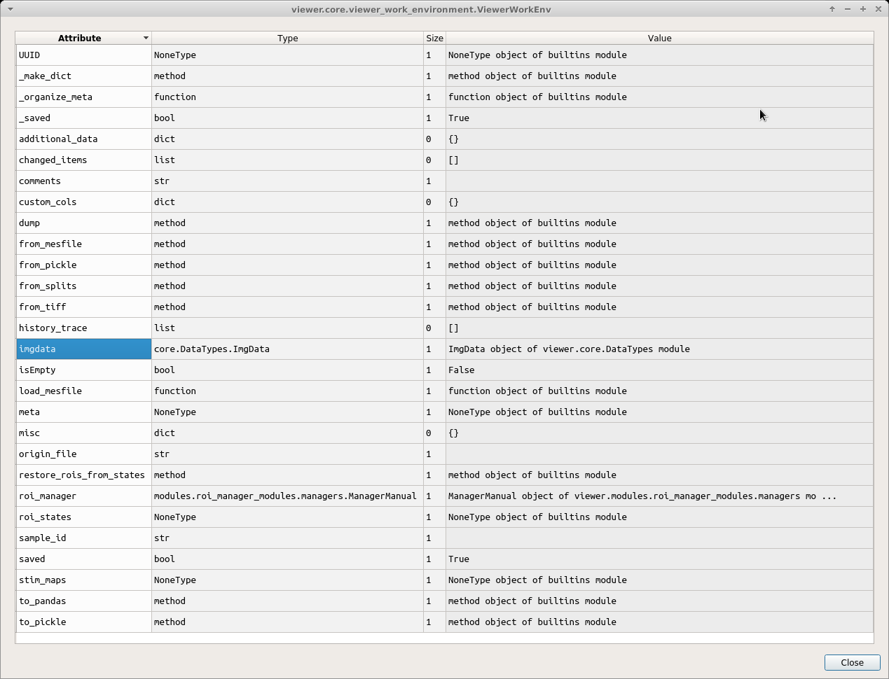
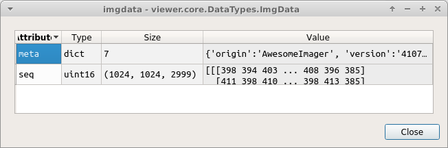

Viewer overview
***************

**The Viewer allows you to do the following things:**

* Examine your calcium movies
* Use a lot of modules to perform things like motion correction, CNMF(E), ROI labeling, and stimulus mapping. See their respective guides for details.
* You can also make modifications to an existing Sample in your project by opening it in the Viewer. See Modify Sample and Overwrite guide.

Viewer layout
-------------

.. image:: ./overview/1.png

To access Viewer modules choose the module you want to run from the Modules menu at the top. All modules, except the Batch Manager, are small floating windows which you can dock into the Viewer by dragging them to an edge of the viewer.

Opening Images
--------------
You can open *tiff* files and *mes* files in the Viewer.
To open a tiff file go to Modules -> Load Images -> Tiff files.

To open tiff files just click the “Select file” button and choose your file.

.. note:: To open files from our whole brain brain you must choose the “asarray” option.

.. image:: ./overview/2.png

When you choose tiff files from the whole brain, it will automatically locate and find the associated .json meta data if it has the same name as that tiff file.

.. image:: ./overview/4.png

.. warning:: If the name of the tiff file and .json meta data file are different, you must specify the .json meta data file using the *Select meta data* button.

.. warning:: **You cannot perform any analysis without the meta data file since you need the sampling rate of the video and it is specified in the meta data file.**

Click the “Load into workEnv” button to load this image into your work environment.

.. note:: If you have an unsaved work environment open (such as a video with ROIs for example) it will prompt you to confirm that you want to clear the work environment before loading the chosen image into the work environment.

Exploring the work environment
------------------------------
You can explore everything, such as meta data, in your work environment by going to View - > Work Environment Editor..

.. note:: This is read only, you cannot edit via this GUI.

For example if you want to see your meta data, double click on “imgdata” and then you can see that “imgdata” has two things, the image sequence (i.e. your video) and the meta data.

If you double click on “meta” above you can see your meta data.

.. image:: ./overview/10.png

A faster way to explore your meta data is through the console.

Open the console by going to View -> Console.
You can then type the following to see the meta data: ``viewer.workEnv.imgdata.meta``

.. image:: ./overview/11.png

